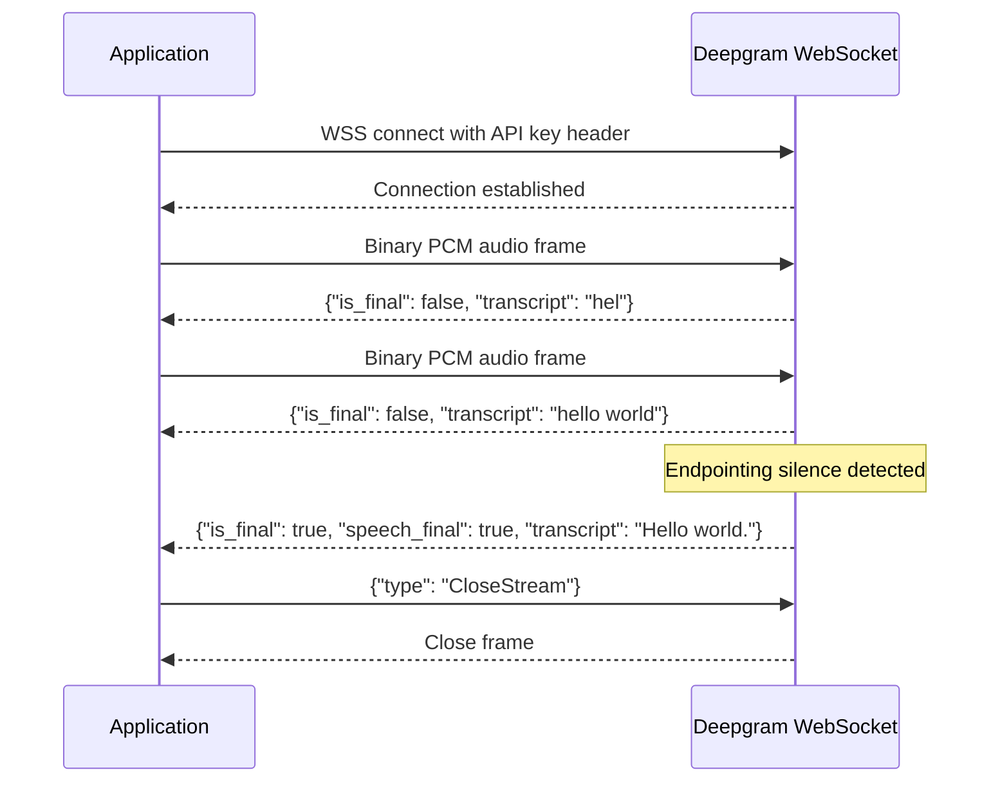

**Category:** Audio & Speech AI Hosting
**Difficulty:** Intermediate
**Reading time:** 6 min read

---

Deepgram's streaming API provides low-latency real-time speech recognition through a WebSocket connection that accepts continuous PCM audio and returns interim and final transcripts as JSON messages. The API supports configurable endpointing (silence detection for utterance segmentation) and KeepAlive messages to maintain sessions during pauses without reconnection overhead. Deepgram's streaming architecture is engineered for sub-300ms first-token latency, making it suitable for conversational AI, live captioning, and real-time voice analytics.

- **Endpointing** — Server-side silence detection that determines utterance boundaries and triggers final transcript emission
- **Interim results** — `is_final: false` transcript messages emitted continuously as audio streams in
- **UtteranceEnd** — Optional message type emitted after endpointing silence period, signaling a clean utterance boundary
- **KeepAlive** — JSON control message sent when audio is paused to prevent session timeout without closing the connection
- **CloseStream** — Control message sent to flush remaining audio and close the session gracefully
- **Encoding parameter** — Audio format declaration required by the API: `linear16`, `mulaw`, `opus`, `aac`, etc.
- **Sample rate** — Audio capture rate in Hz; 16000 Hz is recommended for best model accuracy
- **Multichannel** — Mode that transcribes separate audio channels independently with per-channel results

Deepgram streaming connections are established via WebSocket to `wss://api.deepgram.com/v1/listen` with the API key in the `Authorization: Token <key>` header and feature parameters as query strings. Once connected, the client streams binary audio frames at whatever rate the microphone or audio source produces them — typically 100–250 ms chunks.

The server maintains a streaming acoustic model state across frames, continuously updating its transcription hypothesis. Interim results (`is_final: false`) are sent after every chunk, providing live feedback for UI display. When the endpointing algorithm detects a sufficient silence period (configurable via the `endpointing` parameter, default ~10 samples of 10ms silence), it emits a final result with `is_final: true` and `speech_final: true`.

Endpointing is critical for conversational AI: `speech_final: true` indicates a natural turn boundary suitable for triggering downstream processing (LLM response generation, command execution). The `endpointing` parameter accepts `false` to disable (for non-conversational use cases where you manage segmentation) or an integer milliseconds value.

For telephony integration, Deepgram accepts μ-law encoded audio at 8000 Hz — the native format of PSTN phone calls — eliminating transcoding overhead. The multichannel feature processes caller and agent audio separately, enabling per-speaker transcript streams for call analytics applications.

Session keep-alive during user pauses prevents unnecessary reconnection overhead. The client sends `{"type": "KeepAlive"}` JSON messages every 10 seconds when no audio is being sent; the server responds with `{"type": "KeepAlive"}` to confirm the session remains active.

- Voice bots and conversational AI agents requiring fast utterance-level transcripts
- Live closed captioning for broadcasts and events with sub-second display latency
- Real-time call monitoring for compliance and quality assurance in contact centers
- Voice search interfaces where results update as the user speaks
- Telehealth platforms capturing clinical conversations in real time

| Advantage | Disadvantage |
|-----------|--------------|
| Sub-300ms latency from speech to transcript token | WebSocket management complexity compared to simple REST requests |
| Configurable endpointing for different conversational patterns | Requires continuous audio stream management; network interruptions disrupt sessions |
| KeepAlive prevents costly reconnection during natural pauses | Streaming model may have slightly higher WER than batch mode on some content |
| Native μ-law support eliminates telephony transcoding | Session length limits require application-level session management |

- [Deepgram Speech Recognition](deepgram-speech-recognition.md)
- [AssemblyAI Real-time Transcription](assemblyai-real-time-transcription.md)
- [Voice Activity Detection (VAD)](voice-activity-detection-vad.md)

---
*Part of the [Audio & Speech AI Hosting](index.md) category · [Back to Master Index](../../index.md)*
