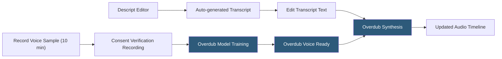

**Category:** Audio & Speech AI Hosting
**Difficulty:** Beginner
**Reading time:** 5 min read

---

Descript Overdub is a voice cloning feature within Descript's AI-powered audio and video editing platform that allows creators to edit recorded speech by typing — replacing words in the audio by synthesizing new speech in the speaker's cloned voice. Unlike API-first TTS platforms, Overdub is primarily a creative editing tool integrated into Descript's timeline editor, enabling correction of mispronunciations, script changes, and gap-filling without re-recording. Overdub voices are scoped to the Descript workspace and protected by speaker consent verification.

- **Overdub voice** — A custom voice model trained from a speaker's recorded audio within Descript
- **Text-based editing** — Descript's core paradigm: editing the auto-generated transcript edits the underlying audio/video
- **Word replacement** — Using Overdub to synthesize spoken words in the creator's voice to replace mistakes or add content
- **Consent recording** — Mandatory training session where the speaker reads specific verification phrases before Overdub can be created
- **Script mode** — Descript editor mode showing only the script with Overdub-generated words highlighted for identification
- **Regenerate** — Re-synthesizing an Overdub word with different parameters when the initial result sounds unnatural
- **Stock voices** — Descript-provided synthetic voices available for use without creating a personal Overdub
- **Underlord AI** — Descript's AI assistant suite including Overdub, AI filler word removal, studio sound, and scene detection

Overdub creation begins with a recording session in Descript where the speaker reads a script of 10 minutes of text covering broad phoneme coverage. Before training, speakers must complete a consent verification by reading specific phrases that Descript uses to confirm they are creating a voice model of their own voice. This consent record is stored and tied to the account.

Once the voice model is trained (typically within hours), it appears as an Overdub voice in the editor. When a creator edits the auto-transcribed text — deleting a word, correcting a spelling, or adding new sentences — Descript identifies which audio segments map to the changed text. Edited words are flagged as "Overdub" in the transcript view and synthesized using the creator's voice model.

The synthesis quality depends on the consistency and quality of the training recordings and the phonemic context of the replacement words. Descript's underlying synthesis model (licensed from or co-developed with voice AI partners) generates audio at the natural prosody of surrounding speech as much as possible by considering the acoustic context of adjacent recorded words.

Overdub does not expose a standalone API for third-party integration; it is exclusively a feature of the Descript editor. For developers needing programmatic voice cloning and synthesis, platforms like ElevenLabs or Resemble.ai provide API-first alternatives. Descript focuses on the creator use case where workflow integration within the editing application is more valuable than API access.

Stock voices provide an Overdub-like experience without personal voice cloning, enabling users to generate filler content or corrections in a generic AI voice when personal voice quality is not required.

- Podcast production teams correcting mispronounced words or inserting sponsor messages without re-recording
- Online course creators updating lesson audio when scripts change without full re-recording sessions
- Corporate training video teams fixing narration mistakes in post-production efficiently
- YouTube creators maintaining voice consistency across edited versions of content
- Audiobook producers making last-minute script corrections without studio time

| Advantage | Disadvantage |
|-----------|--------------|
| Integrated directly in video/audio editor; no API integration required | No standalone API; cannot use Overdub voice outside Descript ecosystem |
| Text-based editing paradigm is intuitive for non-technical creators | Voice model quality limited to Descript's integrated synthesis capabilities |
| Consent verification reduces risk of unauthorized voice cloning | Training requires 10 minutes of recording; not instant like some API-based cloners |
| Stock voices available without personal cloning for generic content | Cloned voice fidelity may not match dedicated voice cloning platforms |

- [ElevenLabs Voice Cloning](elevenlabs-voice-cloning.md)
- [Resemble.ai Voice Cloning](resemble-ai-voice-cloning.md)
- [Speechify API](speechify-api.md)

---
*Part of the [Audio & Speech AI Hosting](index.md) category · [Back to Master Index](../../index.md)*
