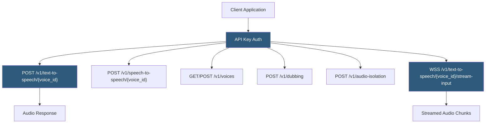

**Category:** Audio & Speech AI Hosting
**Difficulty:** Intermediate
**Reading time:** 5 min read

---

The ElevenLabs API is the programmatic interface exposing the full ElevenLabs platform — text-to-speech synthesis, voice cloning, voice management, audio isolation, speech-to-speech conversion, and the Dubbing API — via REST endpoints and WebSocket streaming. Official SDKs for Python, JavaScript/TypeScript, and other languages wrap the HTTP API with typed interfaces. The API uses API key authentication and character-based quota consumption tracked per request.

- **API key** — Authentication credential passed in the `xi-api-key` header; scoped to a user account with associated character quota
- **Speech-to-speech** — Endpoint that converts input audio speech to output speech in a different voice while preserving prosody
- **Audio isolation** — Background noise removal API that isolates speech from audio files
- **Dubbing API** — Automated video/audio dubbing that transcribes source language, translates, and synthesizes speech in target language
- **Websocket TTS** — Streaming synthesis endpoint over WebSocket for bidirectional low-latency audio generation
- **SDK** — Official Python (`elevenlabs`) and JavaScript (`@elevenlabs/elevenlabs-js`) libraries simplifying API integration
- **Character quota** — Per-month character consumption limit based on subscription tier; tracked in API response headers
- **History** — Server-side log of all synthesis requests with generated audio playback and download

All ElevenLabs API requests require the `xi-api-key` header. The API returns character consumption information in response headers (`Character-Cost` and remaining quota). Exceeding the character quota returns HTTP 429 with a `quota_exceeded` error code.

The standard TTS endpoint (`POST /v1/text-to-speech/{voice_id}`) accepts a JSON body with `text`, `model_id`, `voice_settings`, and `output_format`. The response body is raw audio bytes with appropriate `Content-Type`. The streaming variant (`/stream`) sets `Transfer-Encoding: chunked` and begins returning audio bytes as they're synthesized rather than after full generation, enabling TTFA (time-to-first-audio) under 500ms.

The WebSocket streaming input API (`/stream-input`) enables bidirectional streaming for conversational AI applications. The client sends text chunks as they're generated by an LLM, and the server synthesizes and returns audio chunks in real time. This pipelining — LLM output feeding directly into TTS synthesis — eliminates the sequential wait between LLM completion and TTS start, reducing end-to-end conversational agent latency from 2–3 seconds to under 1 second.

Speech-to-speech conversion accepts audio input and converts the speaker's voice to a target voice while preserving the prosodic patterns (rhythm, pacing, emphasis) of the original. This enables dubbing applications where the translated voice maintains the emotional delivery of the source performance.

The Dubbing API automates the full localization pipeline: submit a video URL, specify source and target languages, and ElevenLabs returns a dubbed video with transcription, translation, and synthesized speech synchronized to the original timeline.

- Conversational AI voice agents using WebSocket streaming-input for minimal response latency
- Automated audiobook pipelines converting ebook content to narrated audio at scale
- Video localization workflows using the Dubbing API for content internationalization
- Podcast production tools generating AI host voices from scripted content
- Customer service IVR systems using synthesized voices for dynamic message generation

| Advantage | Disadvantage |
|-----------|--------------|
| WebSocket stream-input enables LLM-to-TTS pipelining with low latency | Character quota exhaustion causes API failures that must be handled gracefully |
| Comprehensive API covering TTS, cloning, dubbing, and audio isolation | No on-premises deployment; all audio processed through ElevenLabs servers |
| Official SDKs reduce integration boilerplate | SDK versions may lag API capability additions |
| History API enables auditing and regenerating previous synthesis requests | No fine-grained IAM; single API key has access to all account features |

- [ElevenLabs Text-to-Speech](elevenlabs-text-to-speech.md)
- [ElevenLabs Voice Cloning](elevenlabs-voice-cloning.md)
- [PlayHT AI Voice Generation](playht-ai-voice-generation.md)

---
*Part of the [Audio & Speech AI Hosting](index.md) category · [Back to Master Index](../../index.md)*
