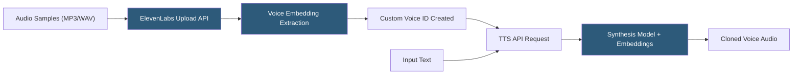

**Category:** Audio & Speech AI Hosting
**Difficulty:** Intermediate
**Reading time:** 6 min read

---

ElevenLabs voice cloning creates a custom synthetic voice from audio recordings of a target speaker, capturing their unique timbre, cadence, and prosodic patterns. Instant Voice Cloning requires as little as one minute of clean audio, while Professional Voice Cloning uses a guided recording process of 30+ minutes to achieve studio-grade fidelity. Cloned voices are stored as Voice IDs accessible via the standard TTS API, enabling branded voice experiences in products without per-use licensing fees for the voice talent.

- **Instant Voice Cloning (IVC)** — Zero-shot cloning from uploaded audio samples (1–5 minutes); available on all paid tiers
- **Professional Voice Cloning (PVC)** — High-fidelity cloning from a structured recording session; available on Creator tier and above
- **Voice samples** — Audio files uploaded to create or update a cloned voice; MP3, WAV, M4A formats accepted
- **Voice embedding** — Neural representation of voice timbre extracted from samples; stored server-side and used to condition synthesis
- **Voice similarity** — Perceptual measure of how closely synthesized audio matches the source speaker; affected by sample quality and quantity
- **Consent verification** — Platform requirement for voice cloning; users confirm rights to clone the submitted voice
- **Voice sharing** — Feature enabling published cloned voices to appear in the ElevenLabs voice library (optional)
- **Voice design** — Alternative to cloning: generating entirely new synthetic voices using attribute sliders without real samples

Instant Voice Cloning operates via the `/v1/voices/add` endpoint, which accepts a `name` parameter and one or more audio sample files as multipart form data. ElevenLabs extracts voice embeddings from the uploaded samples using a speaker encoder model — a neural network trained to map audio segments to fixed-dimensional embedding vectors that capture speaker identity while being invariant to content.

The quality of IVC output depends heavily on sample characteristics: clean, consistent audio with minimal background noise and a single speaker yields significantly better results than noisy or multi-speaker recordings. Samples should cover diverse phoneme combinations and prosodic patterns to capture the full range of the target speaker's voice. Additional samples can be added to an existing voice ID to improve quality incrementally.

Professional Voice Cloning provides a script-guided recording session through the ElevenLabs platform. The script is designed to maximize phoneme coverage and capture multiple speaking styles (neutral, expressive, emphatic). The recorded audio is post-processed and used to train a higher-fidelity voice model with more parameters than the IVC embedding approach, achieving near-indistinguishable quality from the original speaker.

ElevenLabs enforces consent policies: when creating a voice clone, users must confirm they have rights to use the submitted audio. The platform employs audio watermarking (inaudible steganographic signatures) in synthesized audio to enable provenance tracing. AI-generated voice detection features and the ElevenLabs AI Speech Classifier tool help identify cloned content.

For API-based workflows, the voice creation and management API supports listing voices (`GET /v1/voices`), retrieving settings (`GET /v1/voices/{voice_id}/settings`), editing settings (`POST /v1/voices/{voice_id}/settings/edit`), and deleting voices (`DELETE /v1/voices/{voice_id}`).

- Brand voice creation for product assistants without recurring voice talent licensing
- Audiobook production creating an author's voice for narrating their own written works
- Multilingual content localization using a cloned voice to narrate translated versions
- Accessibility tools converting personal text messages to a loved one's voice for motor-impaired users
- Film and media post-production for dubbing and ADR with voice consistency

| Advantage | Disadvantage |
|-----------|--------------|
| Instant cloning from minimal audio enables rapid prototyping | Sample quality significantly impacts cloned voice fidelity |
| Professional cloning achieves near-human quality for high-production use cases | Consent and ethical obligations require careful legal review for commercial use |
| Cloned Voice IDs use the same TTS API; no code changes needed | Audio watermarking may affect use cases requiring clean untagged audio output |
| Voice design enables synthetic voices without real speaker recordings | PVC requires Creator-tier subscription and structured recording session time investment |

- [ElevenLabs Text-to-Speech](elevenlabs-text-to-speech.md)
- [ElevenLabs API](elevenlabs-api.md)
- [Resemble.ai Voice Cloning](resemble-ai-voice-cloning.md)

---
*Part of the [Audio & Speech AI Hosting](index.md) category · [Back to Master Index](../../index.md)*
