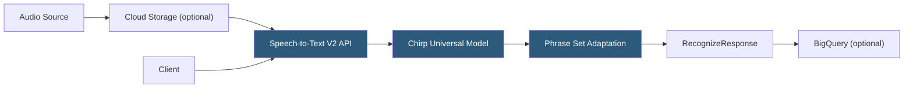

**Category:** Audio & Speech AI Hosting
**Difficulty:** Intermediate
**Reading time:** 6 min read

---

Google Cloud Speech-to-Text provides enterprise-grade automatic speech recognition backed by Google's deep learning models, supporting 125+ languages and dialects with synchronous, asynchronous, and streaming recognition modes. The V2 API introduced Chirp, Google's universal speech model trained on millions of hours of multilingual audio using self-supervised learning. The service integrates natively with Google Cloud's data ecosystem, enabling direct transcription from Cloud Storage, Pub/Sub events, and BigQuery analytics pipelines.

- **Chirp** — Google's foundation speech model using self-supervised learning; state-of-the-art multilingual accuracy with zero-shot language adaptation
- **Recognizer resource** — V2 API concept: a pre-configured ASR configuration (model, language, features) stored as a reusable cloud resource
- **RecognitionConfig** — Configuration object specifying model, language codes, audio encoding, sample rate, and feature flags
- **Long-running operation** — Async pattern for audio files > 1 minute; returns an `Operation` object polled via Operations API
- **Adaptation** — Custom class-based vocabulary injection using phrases and phrase sets to improve domain recognition
- **Speaker diarization** — Configuration flag enabling speaker turn detection with `max_speaker_count` control
- **Word confidence** — Per-word confidence float returned when `enable_word_confidence: true` is set
- **Data logging opt-out** — API flag to prevent audio data from being used for Google model improvement

Google Cloud Speech-to-Text V2 organizes recognition around three request types: synchronous (`Recognize`) for audio ≤ 1 minute in the request body, asynchronous (`BatchRecognize`) for Cloud Storage files of any length, and streaming (`StreamingRecognize`) for real-time audio.

The V2 API introduces the Recognizer resource — a pre-configured recognition profile stored in a Google Cloud project. Rather than embedding RecognitionConfig in every request, teams create a Recognizer with the desired model and features, then reference it by resource name. This reduces per-request payload size and enforces consistent configuration across application instances.

Chirp, the V2 Chirp model, uses a universal acoustic encoder pre-trained across all supported languages simultaneously. Unlike per-language models, Chirp handles code-switching (multilingual speech within a recording) and less-resourced languages that lack sufficient monolingual training data. For production English accuracy, the `latest_long` model remains competitive and offers lower latency.

Phrase Set adaptation injects domain vocabulary as weighted phrases. Phrases with higher `boost` values (0–20) are more likely to be selected over acoustically similar default vocabulary. This is effective for product names, medical acronyms, and legal terminology. Phrase Sets are stored as cloud resources and reused across requests.

For telephony (8 kHz μ-law audio), Speech-to-Text includes phone call-specific models. The service integrates with Dialogflow for intent detection and with Contact Center AI for full call analytics pipelines without requiring custom orchestration.

- Enterprise call centers requiring HIPAA/SOC 2 compliant transcription with Google's compliance certifications
- Multilingual global platforms needing a single model supporting 125+ languages
- Google Cloud-native architectures processing audio from Cloud Storage or Pub/Sub pipelines
- Voice-enabled applications built on Dialogflow leveraging shared Speech-to-Text infrastructure
- Research teams needing Chirp's zero-shot performance on low-resource languages

| Advantage | Disadvantage |
|-----------|--------------|
| 125+ language support including low-resource languages via Chirp | V2 API has a learning curve; Recognizer resource model adds configuration overhead |
| Deep integration with Google Cloud storage, Pub/Sub, BigQuery | Vendor lock-in to Google Cloud ecosystem |
| Enterprise compliance certifications (HIPAA, SOC 2, ISO 27001) | Per-audio-second pricing model can be expensive at scale |
| Phrase Set adaptation is reusable and version-controlled as cloud resources | Data logging opt-out must be explicitly set; default includes usage for model improvement |

- [AWS Transcribe](aws-transcribe.md)
- [Azure Speech Services](azure-speech-services.md)
- [Deepgram Speech Recognition](deepgram-speech-recognition.md)

---
*Part of the [Audio & Speech AI Hosting](index.md) category · [Back to Master Index](../../index.md)*
