**Category:** Audio & Speech AI Hosting
**Difficulty:** Beginner
**Reading time:** 5 min read

---

Google Cloud Text-to-Speech converts text to natural-sounding audio using Google's WaveNet and Neural2 voice technologies, offering 380+ voices across 50+ languages and variants. The API supports SSML for detailed prosody control, multiple audio encoding formats, and voice customization through speaking rate, pitch, and volume gain adjustments. Google's Neural2 voices represent their highest-quality synthesis tier, using neural architectures trained on professional voice talent recordings to produce human-like speech quality.

- **WaveNet** — DeepMind's generative model for raw audio waveform synthesis; foundational technology behind Google Cloud TTS quality
- **Neural2** — Google's highest-quality TTS voice tier using improved WaveNet-based architecture for more natural prosody
- **Standard voices** — Concatenative synthesis voices; lower cost and latency but less natural than Neural2
- **SSML** — Speech Synthesis Markup Language; XML-based markup for controlling rate, pitch, pauses, and pronunciation
- **Speaking rate** — Multiplier (0.25–4.0×) controlling speech speed; 1.0 is normal rate
- **Pitch** — Semitone adjustment (-20 to +20) shifting voice pitch up or down
- **Audio profile** — Optimization preset tuning output for specific playback hardware (headphones, wearable, telephony)
- **Long Audio API** — Asynchronous endpoint for synthesizing texts over 5000 bytes, outputting to Google Cloud Storage

```mermaid
graph LR
    Text["Text / SSML Input"] --> API["Cloud TTS API"]
    API --> VoiceSelect["Voice Selection (language + name)"]
    VoiceSelect --> Neural2["Neural2 / WaveNet Engine"]
    Neural2 --> AudioProfile["Audio Profile Optimization"]
    AudioProfile --> Encode["Audio Encoding (MP3/OGG/LINEAR16)"]
    Encode --> Response["Base64 Audio Response"]
    style API fill:#2d5a7a,color:#fff
    style Neural2 fill:#2d5a7a,color:#fff
    style AudioProfile fill:#2d5a7a,color:#fff
```

Google Cloud TTS requests are made to the `POST /v1/text:synthesize` endpoint with a `SynthesisInput` containing either `text` or `ssml`, a `VoiceSelectionParams` specifying language code and voice name or gender, and `AudioConfig` controlling encoding, sample rate, speaking rate, pitch, and effects profile.

Neural2 voices are Google's premium tier. They are trained on large amounts of voice talent recordings using techniques derived from WaveNet, producing audio that scores highly on mean opinion score (MOS) evaluations for naturalness. Standard voices use traditional concatenative synthesis, stitching pre-recorded phoneme units — they are faster and cheaper but sound more robotic on longer passages.

SSML provides fine-grained control beyond the basic parameter adjustments. Key SSML elements include `<break time="500ms"/>` for explicit pauses, `<emphasis level="strong">` for word emphasis, `<say-as interpret-as="date">` for instructing the engine how to verbalize specific content types, `<phoneme>` for IPA-based pronunciation overrides, and `<prosody rate="slow">` for segment-level rate control.

The audio profile feature optimizes output for specific playback contexts: `wearable-class-device` reduces bass for small speakers, `telephony-class-application` applies 8 kHz μ-law optimization for phone playback, and `headphone-class-device` uses the full frequency range for high-fidelity playback.

For texts exceeding 5000 bytes, the Long Audio API submits an async synthesis operation to Google Cloud and writes the output directly to a Cloud Storage bucket, avoiding the 5000-byte synchronous limit and the overhead of base64 encoding large audio in REST responses.

- Google Cloud-native applications requiring TTS alongside other Google AI services
- Multilingual global applications needing 50+ language coverage from a single provider
- IVR and telephony applications using the telephony audio profile for 8 kHz optimization
- Accessibility features in Google Workspace and Android applications
- E-learning platforms using SSML for precise pacing and emphasis in instructional audio

| Advantage | Disadvantage |
|-----------|--------------|
| Neural2 voices among highest quality for many languages | Per-character pricing; costs scale linearly with text volume |
| 380+ voices across 50+ languages | Base64 audio encoding in REST responses is inefficient for large audio files |
| SSML support for fine-grained prosody control | 5000-byte synchronous limit requires Long Audio API for longer content |
| Audio profiles optimize for specific playback hardware | No voice cloning; custom voices require Custom Voice product (limited availability) |

- [Azure Neural TTS](azure-neural-tts.md)
- [AWS Polly](aws-polly.md)
- [ElevenLabs Text-to-Speech](elevenlabs-text-to-speech.md)

---
*Part of the [Audio & Speech AI Hosting](index.md) category · [Back to Master Index](../../index.md)*
