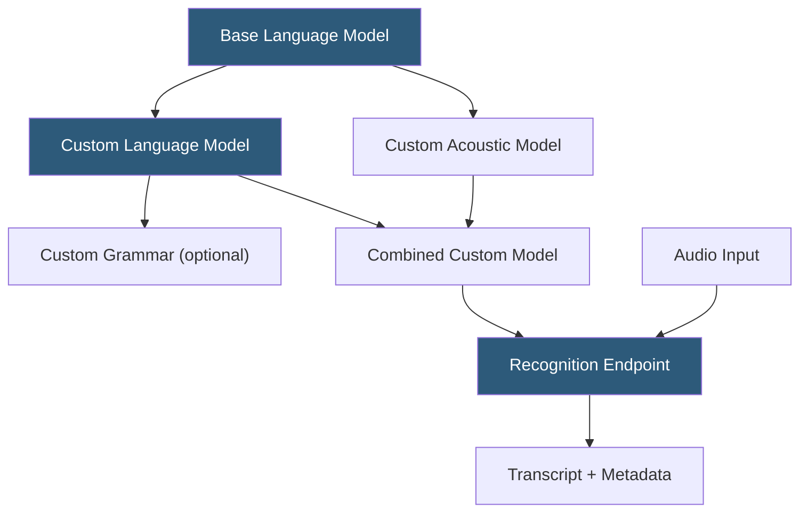

**Category:** Audio & Speech AI Hosting
**Difficulty:** Intermediate
**Reading time:** 5 min read

---

IBM Watson Speech to Text is an enterprise speech recognition service available on IBM Cloud and as a containerized on-premises deployment via IBM Cloud Pak for Data. The service supports synchronous, asynchronous, and WebSocket streaming recognition with customization through acoustic and language model adaptation. Watson STT is widely deployed in regulated industries — banking, insurance, healthcare — where on-premises deployment and IBM's enterprise support contracts are key requirements.

- **Base model** — Pre-trained model for a specific language-band combination (e.g., `en-US_BroadbandModel` for telephony-quality audio)
- **Narrowband vs broadband** — Models optimized for 8 kHz telephone audio vs 16 kHz or higher wideband audio respectively
- **Language model customization** — Training a custom language model on domain corpora using n-gram adaptation
- **Acoustic model customization** — Fine-tuning acoustic models on domain audio recordings (rare in modern deployments)
- **Custom grammars** — Restricted vocabulary grammars for command-and-control applications limiting recognition to specific words/phrases
- **Speaker diarization** — Multi-speaker turn detection with speaker labels in transcript output
- **Smart formatting** — Post-processing that converts spoken expressions to formatted text (dates, times, currencies)
- **IBM Cloud Pak for Data** — On-premises IBM Watson deployment platform enabling data residency compliance

Watson STT offers multiple recognition interfaces: synchronous REST for short audio (< 100 MB), asynchronous callbacks with HTTP webhook notification for longer files, and a WebSocket interface for streaming. The WebSocket interface uses a text control message to open a session with the recognition configuration, followed by binary audio frames, enabling continuous speech processing.

Language model customization adapts the n-gram language model to domain vocabulary by training on plain text corpora. Teams upload text files containing sentences representative of expected speech content; Watson builds a custom n-gram model layered on top of the base model. This approach is data-efficient: 50,000–100,000 words of domain text typically yields measurable WER improvement on in-domain content.

Acoustic model customization (acoustic AM) is available for environments with severe background noise or unusual acoustic conditions not represented in the base model training data. Teams upload labeled audio and Watson fine-tunes acoustic feature extraction. AM customization is more data-intensive than LM customization and is less commonly needed with modern base models.

Custom grammars restrict the recognition vocabulary to a defined set of words or phrases using ABNF (Augmented Backus-Naur Form) grammar syntax. This is valuable for IVR-style command-and-control applications where false positive recognition of arbitrary speech would cause errors; confining the decoder to "yes", "no", and digit sequences eliminates most recognition errors for simple command interfaces.

On-premises deployment via Cloud Pak for Data runs Watson services as Kubernetes-deployed containers within customer data centers, using the same REST API contract as the cloud service.

- Financial services IVR systems requiring on-premises deployment and IBM enterprise support
- Healthcare clinical documentation with on-premises data residency requirements
- Insurance call center transcription with acoustic model adaptation for call center audio
- Banking voice authentication and command systems using custom grammars
- Government agencies requiring FedRAMP-authorized IBM Cloud deployment

| Advantage | Disadvantage |
|-----------|--------------|
| On-premises Cloud Pak for Data deployment for full data residency | Slower model innovation cadence compared to pure-cloud ASR competitors |
| Both language and acoustic model customization options | IBM ecosystem lock-in and higher enterprise licensing costs |
| Custom grammar support for constrained vocabulary command interfaces | Base model accuracy lags behind newer foundation models like Chirp or Nova-2 |
| Strong IBM enterprise support SLAs and compliance certifications | Narrowband/broadband model selection adds configuration complexity |

- [Google Cloud Speech-to-Text](google-cloud-speech-to-text.md)
- [AWS Transcribe](aws-transcribe.md)
- [Azure Speech Services](azure-speech-services.md)

---
*Part of the [Audio & Speech AI Hosting](index.md) category · [Back to Master Index](../../index.md)*
