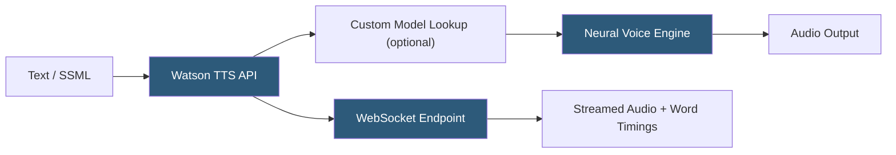

**Category:** Audio & Speech AI Hosting
**Difficulty:** Intermediate
**Reading time:** 5 min read

---

IBM Watson Text to Speech provides neural speech synthesis as part of IBM's Watson AI portfolio, offering voices across multiple languages with SSML support, custom pronunciation models via custom voices, and deployment options spanning IBM Cloud and on-premises via Cloud Pak for Data. The service is notable for its enterprise-grade support contracts, IBM's FedRAMP and HIPAA compliance certifications, and the ability to run completely on-premises for organizations with strict data governance requirements.

- **Neural voices** — Modern deep learning-based voices offering improved naturalness compared to IBM's older concatenative Expressive voices
- **Custom model** — Pronunciation dictionary that maps words to custom phoneme representations, stored and referenced by ID in synthesis requests
- **Word** — Individual lexical entry in a custom model; associates a word string with a `sounds_like` phoneme translation
- **SSML** — Speech Synthesis Markup Language support with `<phoneme>` for explicit pronunciation and `<prosody>` for rate/pitch control
- **WebSocket synthesis** — Bidirectional WebSocket API for streaming audio and receiving word timing marks simultaneously
- **Word timings** — Optional timestamp metadata returned alongside streamed audio via WebSocket for synchronized applications
- **Cloud Pak for Data** — IBM's on-premises deployment platform enabling Watson services behind corporate firewalls
- **Speaker ID** — Identifier enabling voice consistency tracking for multi-segment synthesis ensuring the same voice across requests

Watson TTS exposes a `POST /v1/synthesize` endpoint accepting text or SSML with query parameters for `voice`, `accept` (audio format), and optional `customization_id`. The `accept` header controls output format: `audio/mp3`, `audio/wav`, `audio/ogg;codecs=opus`, `audio/flac`, etc. The response streams audio bytes directly.

Custom models address Watson TTS's primary limitation for enterprise deployments: domain-specific terminology. A custom model is a JSON dictionary of word-to-phoneme mappings created via `POST /v1/customizations`. Words are added individually or in bulk via `POST /v1/customizations/{id}/words`. Each word entry contains `word` (the surface form) and `translation` (either an IPA phoneme string or a `sounds_like` English respelling). Custom models are referenced by ID in synthesis requests.

The WebSocket API (`GET /v1/synthesize`) accepts an upgrade to WebSocket, then the client sends a text JSON message. The server streams back binary audio chunks interleaved with JSON text messages containing word timing marks — timestamps for each word aligned with the audio stream. This is the primary interface for applications requiring synchronized text highlighting or animated visuals without post-processing audio analysis.

On-premises deployment via Cloud Pak for Data packages the Watson TTS service as Kubernetes operators and containers. The deployment runs within the customer's OpenShift cluster; audio processing never leaves the customer's infrastructure. IBM provides model updates as container image updates via IBM's private container registry.

SSML pronunciation overrides via `<phoneme alphabet="ipa" ph="...">` and `<phoneme alphabet="ibm" ph="...">` provide two phoneme alphabets; IBM SPR (Speech Pronunciation Representation) is easier to use for non-linguists than IPA for common pronunciation adjustments.

- Federal government and regulated industry applications requiring FedRAMP-authorized deployment
- Healthcare systems running Watson on-premises via Cloud Pak for HIPAA compliance
- Enterprise IVR systems using IBM Watson ecosystem integration with Watson Assistant
- Multilingual enterprise applications within IBM Cloud requiring a single vendor for all AI services
- Long-running production deployments where IBM enterprise support SLAs are a contractual requirement

| Advantage | Disadvantage |
|-----------|--------------|
| On-premises Cloud Pak deployment for full data residency | Voice quality and variety behind modern cloud-native TTS providers |
| IBM phoneme representation (IBM SPR) easier than IPA for custom pronunciations | Slower cadence of voice and language additions compared to Google and Azure |
| FedRAMP and HIPAA certified deployments available | Higher cost for comparable functionality in cloud-native applications |
| Word timing via WebSocket enables synchronized UI without audio analysis | OpenShift/Kubernetes expertise required for on-premises deployment |

- [AWS Polly](aws-polly.md)
- [Azure Neural TTS](azure-neural-tts.md)
- [Google Cloud Text-to-Speech](google-cloud-text-to-speech.md)

---
*Part of the [Audio & Speech AI Hosting](index.md) category · [Back to Master Index](../../index.md)*
