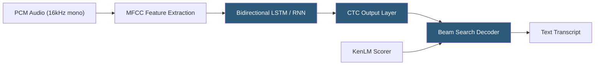

**Category:** Audio & Speech AI Hosting
**Difficulty:** Advanced
**Reading time:** 6 min read

---

Mozilla DeepSpeech is an open-source speech-to-text engine based on Baidu's DeepSpeech architecture, implemented in TensorFlow and released under the Mozilla Public License. Although Mozilla discontinued active development in 2021, DeepSpeech remains widely deployed for offline, privacy-preserving ASR applications due to its small model footprint (under 200 MB) and native support for embedded and edge devices through TensorFlow Lite. Community forks like Coqui STT have continued development from the DeepSpeech codebase.

- **CTC (Connectionist Temporal Classification)** — Loss function and decoder used by DeepSpeech to map variable-length acoustic sequences to text without explicit alignment
- **Scorer** — External language model file (KenLM n-gram) used at inference time to improve transcription accuracy via beam search rescoring
- **TensorFlow Lite model** — Quantized, compressed model variant for deployment on mobile, Raspberry Pi, and other resource-constrained devices
- **Beam search** — Decoder algorithm that maintains multiple candidate transcriptions simultaneously, selecting the most probable final result
- **Alpha/beta tuning** — Scorer hyperparameters controlling the weight of the language model (alpha) and word insertion penalty (beta) in beam search
- **Stream transcription** — DeepSpeech API mode that processes audio in chunks, enabling real-time transcription with bounded memory
- **MFCC features** — Mel-frequency cepstral coefficients extracted from raw audio as input features to the acoustic model
- **Custom scorer** — User-built KenLM language model trained on domain text to improve vocabulary recognition

DeepSpeech's acoustic model is a deep bidirectional LSTM network. Raw audio is converted to 26 MFCC features per 20ms frame with 10ms stride. The network processes sequences of overlapping frames, with recurrent layers capturing temporal context across the utterance. The final fully-connected layer outputs per-frame probability distributions over the alphabet plus a blank token used by CTC.

The CTC decoder converts frame-level character probabilities to a text sequence without requiring explicit speech-text alignment in training. During inference, beam search explores multiple candidate sequences simultaneously, with a configurable beam width (default 1024) trading accuracy for speed. The external KenLM scorer rescores beam candidates using n-gram language model probabilities, significantly improving contextual word selection accuracy.

Hosting DeepSpeech as a service requires a Python or C++ inference server. The Python API exposes `stt()` for single-shot file transcription and streaming context APIs (`createStream`, `feedAudioContent`, `finishStream`) for chunk-by-chunk real-time transcription. The streaming API is memory-bounded since it processes audio in fixed-size windows rather than buffering entire recordings.

TFLite deployment reduces the English model from ~188 MB to ~47 MB at some accuracy cost, enabling deployment on ARM devices, Raspberry Pi 4, and Android/iOS applications. CPU-only inference suffices for most DeepSpeech workloads; the network architecture is too small to benefit significantly from GPU acceleration.

Custom scorers are built with KenLM using domain-specific text corpora, then compiled to a binary `.scorer` file. Retraining the acoustic model from scratch requires substantial GPU resources and labeled audio data; fine-tuning from a pre-trained checkpoint is more practical.

- Fully offline voice command systems for air-gapped or privacy-sensitive environments
- Embedded device ASR for smart home appliances and voice-controlled interfaces
- Open-source applications requiring a commercially licensable (MPL) speech engine
- Research prototypes needing a trainable baseline ASR model with accessible architecture
- Edge computing deployments processing audio locally without cloud API dependencies

| Advantage | Disadvantage |
|-----------|--------------|
| Fully offline; no cloud connectivity or data transmission required | Discontinued by Mozilla in 2021; no ongoing base model updates |
| Small model footprint enables embedded and edge deployment | Accuracy lags significantly behind modern neural ASR models |
| MPL open-source license permits commercial use without royalties | Limited to English for well-trained models; other languages require community-built models |
| Streaming API enables bounded-memory real-time processing | Fine-tuning requires TensorFlow expertise and labeled audio datasets |

- [Vosk Offline Speech Recognition](vosk-offline-speech-recognition.md)
- [Coqui STT Platform](coqui-stt-platform.md)
- [Whisper Model Deployment](whisper-model-deployment.md)

---
*Part of the [Audio & Speech AI Hosting](index.md) category · [Back to Master Index](../../index.md)*
