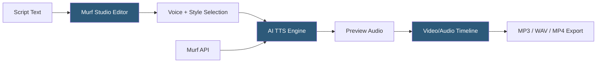

**Category:** Audio & Speech AI Hosting
**Difficulty:** Beginner
**Reading time:** 5 min read

---

Murf.ai is an AI voice generation platform targeting content creators and business professionals, offering 120+ studio-quality AI voices across 20+ languages through a web editor and API. The platform emphasizes workflow simplicity: users can create voiceovers directly in the browser, sync speech to video timelines, and access voices with various styles and accents. Murf positions itself as a professional voiceover production tool rather than a developer API platform, though an API is available for programmatic integration.

- **Studio editor** — Browser-based voiceover production environment with timeline, video sync, and script management
- **Voice styles** — Pre-configured delivery variations (conversational, promo, narration, newscast) available for each voice character
- **Murf API** — REST API for programmatic TTS generation outside the studio editor
- **Pronunciation editor** — In-editor tool for correcting mispronounced words using phonetic input
- **Voice changer** — Feature converting recorded human speech to a selected Murf AI voice
- **Background music** — Integrated library of royalty-free music tracks combinable with voiceovers in the studio
- **Video sync** — Feature aligning synthesized speech pacing to video clip durations by adjusting speech rate
- **Team collaboration** — Multi-user workspace with shared project access and commenting

Murf's studio editor is the primary product interface. Users enter script text, select a voice and style, and the platform synthesizes a preview. The editor displays the synthesized audio as waveform segments on a timeline, allowing individual sentence re-synthesis, reordering, and pacing adjustment. The pronunciation editor resolves mispronunciation by accepting phonetic respellings or IPA notation at the word level.

Voice styles within Murf represent pre-configured voice actor delivery modes rather than arbitrary SSML prosody settings. A voice might offer `Conversational`, `Narration`, `Promo`, and `Newscast` styles — each reflecting the voice actor's distinct recorded delivery for that context. This simplifies selection for non-technical users who know the content type rather than the technical prosody parameters to achieve it.

Video sync addresses a practical challenge in voiceover production: synthesized speech duration doesn't always match intended video segment lengths. Murf's video sync feature analyzes the video timeline and adjusts per-segment speech rate (within natural-sounding bounds) to match script segments to clip durations automatically.

The Murf API follows standard REST patterns: `POST /generate` with `voice_id`, `style`, `text`, `rate`, `pitch`, and `format` parameters returns an audio URL. Character-based billing applies to API usage. The API lacks some features available in the studio editor (voice changer, video sync) since these are workflow-level features rather than synthesis parameters.

Enterprise plans include custom AI voice creation, enabling organizations to synthesize audio in a branded voice across all Murf workflows and the API.

- Marketing teams creating video ad voiceovers without voice talent recording sessions
- E-learning content developers producing course narration with style-matched delivery
- Corporate training video producers creating consistent narration across large content libraries
- Podcast producers adding AI-narrated segments or summaries to episodes
- Small businesses creating professional IVR prompts and product demo videos

| Advantage | Disadvantage |
|-----------|--------------|
| Studio editor enables non-technical users to produce polished voiceovers | API less feature-complete than studio editor; primarily synthesis without workflow tools |
| Video sync feature solves duration-matching without manual pacing adjustment | Narrower language support (20+ languages) than cloud provider TTS services |
| Voice styles abstract prosody control for business users | API pricing per character; no clear self-service volume pricing for high usage |
| Team collaboration features support multi-user production workflows | Custom AI voice creation limited to enterprise plans |

- [ElevenLabs Text-to-Speech](elevenlabs-text-to-speech.md)
- [WellSaid Labs Enterprise TTS](wellsaid-labs-enterprise-tts.md)
- [Replica Studios Voice AI](replica-studios-voice-ai.md)

---
*Part of the [Audio & Speech AI Hosting](index.md) category · [Back to Master Index](../../index.md)*
