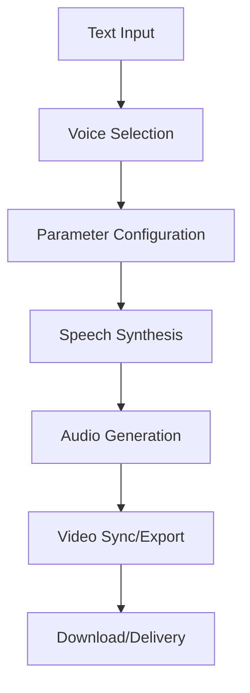

**Category:** Audio & Speech AI Hosting
**Difficulty:** Intermediate
**Reading time:** 6 min read

---

Murf.ai is an AI voice generation platform offering a library of pre-built synthetic voices for text-to-speech conversion. It provides an intuitive interface for non-technical users to create voiceovers for videos, presentations, and content, with support for over 20 languages and multiple voice styles and genders.

- **Voice Library** — collection of pre-trained synthetic voices in multiple languages and genders
- **Text-to-Speech Conversion** — automated generation of audio from written text without human narration
- **Video Integration** — direct upload and automatic voice synchronization with video content
- **Real-time Preview** — immediate playback of generated speech with parameters adjustable before download
- **Commercial License** — rights to use generated voice content in professional and commercial projects

Users input text or script content and select from the available voice library based on language, accent, gender, and style preferences. The interface allows real-time adjustment of speech rate, pitch, emphasis, and pause timing. The synthesis engine converts text phonetically and applies the selected voice model characteristics. For video projects, Murf's engine analyzes video duration and auto-fits speech to match video length, inserting natural pauses at sentence breaks. Generated audio is encoded in multiple formats (MP3, WAV, AAC). The platform provides direct video editing with synchronized voiceover output, or users can download audio for use in external editing tools. All generated content comes with commercial usage rights suitable for professional projects.

- YouTube and social media video voiceovers without hiring voice actors
- E-learning and online course narration at scale
- Podcast and audiobook production with consistent voice quality
- Corporate training and internal communication materials
- Product demonstrations and explainer videos

| Advantage | Disadvantage |
|-----------|--------------|
| Large selection of pre-trained voices (no cloning needed) | Less customizable than voice cloning services |
| Intuitive interface suitable for non-technical users | May sound repetitive if same voice used across projects |
| Integrated video editing and synchronization | Limited emotional range compared to human narration |
| Affordable pricing with commercial licensing included | Accent accuracy varies by language |
| Fast turnaround from text to finished voiceover | No ability to create completely unique voice variants |

- [Resemble.ai Voice Cloning](resembleai-voice-cloning.md)
- [Audio Production Tools](../../audio-speech-ai-hosting/index.md)
- [Video Content Creation](../../index.md)

---
*Part of the [Audio & Speech AI Hosting](index.md) category · [Back to Master Index](../../index.md)*
