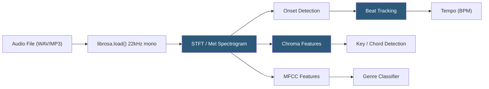

**Category:** Audio & Speech AI Hosting
**Difficulty:** Intermediate
**Reading time:** 6 min read

---

Music Information Retrieval (MIR) is the science and engineering of extracting structured musical information from audio signals, including tempo, key, chords, melody, beat positions, and structural segments. MIR techniques underpin Spotify's recommendation engine, DJ mixing software, music education apps, and content ID systems. Key Python libraries include librosa (signal processing), essentia (MIR algorithms), and mir_eval (evaluation framework), with Hugging Face hosting pretrained models for specialized tasks like chord recognition and beat tracking.

- **BPM (beats per minute)** — Tempo measurement extracted via beat tracking algorithms analyzing onset strength envelope periodicity
- **Key detection** — Tonal key estimation using chroma feature templates matched against major/minor key profiles
- **Chroma features** — 12-dimensional pitch class energy representation useful for harmonic analysis regardless of octave
- **Beat tracking** — Temporal localization of rhythmic beat positions using dynamic programming on onset strength envelopes
- **Spectral features** — Zero-crossing rate, spectral centroid, spectral bandwidth, and MFCCs extracted for genre classification and similarity
- **Structural segmentation** — Identifying music sections (intro, verse, chorus, bridge, outro) using self-similarity matrix analysis
- **Onset detection** — Locating the start times of musical notes or percussive events for transcription and synchronization
- **Music similarity / embedding** — Dense vector representations of music clips enabling nearest-neighbor similarity search for recommendation

MIR pipelines begin with audio loading and preprocessing: converting to mono at a standard sample rate (22050 Hz for librosa), applying pre-emphasis filtering to boost high-frequency content, and computing the Short-Time Fourier Transform (STFT) to obtain time-frequency representations.

Beat tracking in librosa uses an algorithm that computes an onset strength signal (measuring the rate of energy increase across frequency bands over time) and finds the most consistent periodicity using dynamic programming. The result is a sequence of beat frame indices converted to timestamps. Tempo estimation is derived from the inter-beat interval statistics.

Key detection uses chroma features — the energy in each of the 12 pitch classes (C, C#, D, ..., B) summed across octaves. The chroma vector is compared against the 24 major/minor key profile templates using cosine similarity; the key with the highest match score is returned. Krumhansl-Schmuckler key profiles are the standard template set.

For hosted MIR as a service, AcousticBrainz (now defunct) was the primary public API; the field has largely moved to self-hosted libraries or commercial services like the Spotify API (for metadata rather than raw MIR). For self-hosting, librosa and essentia run on standard CPUs without GPU requirements. Deep learning-based MIR tasks (chord recognition, melody extraction) use Hugging Face models based on Wav2Vec2 or CNN architectures fine-tuned on labeled music datasets.

Music similarity embedding models (e.g., MERT, CLAP-music) produce fixed-dimensional vectors that can be indexed in a vector database (Pinecone, Weaviate, pgvector) for music recommendation by similarity search.

- DJ software auto-matching tempo and key for harmonic mixing of tracks
- Music streaming recommendation engines using similarity embeddings for playlist generation
- Music education apps providing real-time chord recognition feedback for practice
- Podcast and video editing tools automatically synchronizing background music to beat markers
- Rights management systems identifying music structure for licensing and composition analysis

| Advantage | Disadvantage |
|-----------|--------------|
| librosa and essentia provide comprehensive MIR without API costs | Beat tracking and key detection accuracy degrades on complex polyphonic or atonal music |
| CPU-only execution; no GPU infrastructure required for most MIR tasks | Deep learning-based MIR (chord recognition) requires GPU for real-time performance |
| Open-source libraries with extensive documentation and community support | Music information is nuanced; human annotations often disagree, limiting ground truth quality |
| Vector similarity enables scalable music recommendation at millions of tracks | Embedding quality varies by genre; models trained on Western music perform poorly on global music |

- [Audio Classification APIs](audio-classification-apis.md)
- [Audio Fingerprinting Services](audio-fingerprinting-services.md)
- [Real-time Audio Processing](real-time-audio-processing.md)

---
*Part of the [Audio & Speech AI Hosting](index.md) category · [Back to Master Index](../../index.md)*
