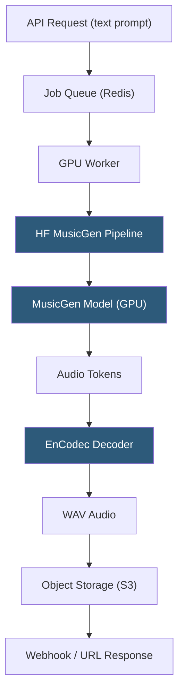

**Category:** Audio & Speech AI Hosting
**Difficulty:** Advanced
**Reading time:** 6 min read

---

MusicGen is Meta's autoregressive text-to-music model that generates high-quality music from text descriptions and optional melody conditioning, available in sizes from 300M to 3.3B parameters under the MIT license. Self-hosting MusicGen enables integration into commercial products, custom fine-tuning on specific music styles, and batch music generation at scale. The Hugging Face transformers library provides the most accessible deployment path, while direct AudioCraft installation offers more features including melody conditioning.

- **text-to-music** — Generating music audio from natural language descriptions of style, mood, instruments, and tempo
- **MusicGen-small** — 300M parameter model fitting in 4 GB VRAM; suitable for CPU-assisted or low-VRAM GPU deployment
- **MusicGen-large** — 3.3B parameter model for highest quality; requires 16+ GB VRAM
- **MusicGen-melody** — Variant that accepts a reference audio clip as melody conditioning alongside the text prompt
- **Hugging Face pipeline** — `transformers` library `pipeline("text-to-audio")` providing the simplest MusicGen integration
- **CFG scale** — Guidance scale controlling how strictly the output follows the text prompt (1.0–10.0 typical range)
- **Max new tokens** — Controls output duration; 256 tokens ≈ 5 seconds of audio at MusicGen's 50 Hz token rate
- **Fine-tuning** — Training a MusicGen checkpoint on a custom music dataset to specialize for a specific genre or style

MusicGen deployment via Hugging Face transformers uses the `pipeline("text-to-audio", model="facebook/musicgen-small")` interface. The pipeline handles model loading, tokenization, generation, and audio decoding. The `generate` method accepts a list of text prompts and returns raw audio arrays with the model's native sample rate (32 kHz).

For production serving, the recommended pattern decouples audio generation from request handling using a job queue. A FastAPI server receives generation requests and enqueues jobs; GPU worker processes dequeue jobs, run MusicGen inference, and store the resulting WAV file to object storage. Clients poll for job completion or receive webhook callbacks with the download URL.

Duration control is achieved through `max_new_tokens`: MusicGen generates EnCodec tokens at approximately 50 Hz (50 tokens per second), so `max_new_tokens=1500` produces 30 seconds of audio. Longer generation requires proportionally more memory and compute; the transformer's attention scales quadratically with sequence length, making very long generations (> 2 minutes) impractical on a single GPU without chunked generation strategies.

Fine-tuning MusicGen on a custom dataset requires the AudioCraft training recipe. The standard approach is supervised fine-tuning on audio-description pairs: pair music clips with text descriptions and run the AudioCraft training script with a frozen text encoder and updated autoregressive transformer weights. A dataset of 1000–5000 high-quality clips with accurate descriptions is sufficient for style specialization.

GPU memory optimization: model quantization with bitsandbytes reduces MusicGen-large from ~13 GB to ~7 GB in int8, enabling deployment on consumer 8 GB VRAM GPUs at some quality cost.

- Background music API for video creation platforms offering text-to-music as a feature
- Game studios generating adaptive game music from mood and environment description prompts
- Advertising agencies creating custom music for campaigns without stock music licensing
- Music production tools generating reference demos or arrangement ideas from descriptions
- Research platforms exploring musical style transfer and generative audio models

| Advantage | Disadvantage |
|-----------|--------------|
| MIT license enables unrestricted commercial deployment | 30-second output limit per generation requires chunking for longer compositions |
| Hugging Face integration provides well-documented deployment path | Large model (3.3B) requires 16+ GB VRAM for quality production deployment |
| Text prompts are intuitive for non-musician content creators | Output quality inconsistent; some prompts produce better results than others |
| Fine-tuning enables genre specialization without training from scratch | No stereo output from MusicGen-small; stereo requires MusicGen-stereo model |

- [AudioCraft Model Hosting](audiocraft-model-hosting.md)
- [Stable Audio Generation](stable-audio-generation.md)
- [Bark Text-to-Audio Model](bark-text-to-audio-model.md)

---
*Part of the [Audio & Speech AI Hosting](index.md) category · [Back to Master Index](../../index.md)*
