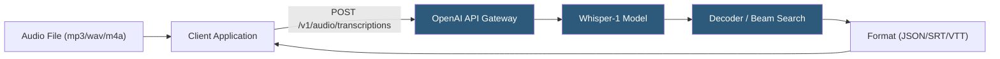

**Category:** Audio & Speech AI Hosting
**Difficulty:** Beginner
**Reading time:** 5 min read

---

The OpenAI Whisper API provides hosted access to OpenAI's open-source Whisper automatic speech recognition (ASR) model via a simple REST endpoint. Developers submit audio files up to 25 MB and receive transcriptions or translations in JSON, plain text, SRT, VTT, or verbose JSON formats. The managed API eliminates the operational complexity of self-hosting GPU inference infrastructure while delivering multilingual transcription accuracy across 99 supported languages.

- **Whisper** — OpenAI's encoder-decoder transformer ASR model trained on 680,000 hours of multilingual audio
- **Transcription endpoint** — `/v1/audio/transcriptions` — returns speech as text in the source language
- **Translation endpoint** — `/v1/audio/translations` — translates non-English speech to English text in one step
- **Model size** — API currently uses `whisper-1` (equivalent to large-v2); self-hosted deployments offer tiny/base/small/medium/large variants
- **Response format** — Output format selector; `verbose_json` includes word-level timestamps and segment confidence scores
- **Prompt parameter** — Optional text hint to prime the model's vocabulary and improve domain-specific terminology recognition
- **Temperature** — Sampling randomness; 0 for deterministic output; higher values increase variation
- **Language hint** — ISO-639-1 code that bypasses language detection and speeds up inference

The Whisper API wraps OpenAI's Whisper large model behind a standard multipart/form-data HTTP endpoint. Clients POST the audio file along with parameters (`model`, `language`, `response_format`, `temperature`, `prompt`). The API decodes audio using Whisper's encoder-decoder architecture: a Mel spectrogram encoder converts raw audio into acoustic embeddings, and an autoregressive decoder generates text tokens using beam search.

The hosted service preprocesses audio server-side — resampling to 16 kHz mono, applying noise normalization — so clients do not need to pre-process files. Audio longer than the model's 30-second context window is automatically chunked; the API stitches segments using voice activity detection (VAD) to find natural pause boundaries.

Response latency scales roughly linearly with audio duration: a 1-minute clip typically returns in 10–20 seconds on the managed endpoint. For longer recordings, the `verbose_json` format provides segment-level start/end timestamps and token-level confidence data, enabling downstream word highlighting or chaptering.

The `prompt` parameter is particularly valuable for domain adaptation: injecting technical vocabulary (medical terms, product names, acronyms) biases the decoder toward correct spellings without fine-tuning. Pricing is per-minute of audio with no per-request overhead, making cost predictable for batch transcription workloads.

- Automated meeting transcription for productivity and compliance archiving
- Podcast show notes and searchable transcript generation
- Customer support call transcription for quality assurance and analytics
- Subtitle generation for video content in SRT or VTT format
- Multilingual voice command processing in consumer applications

| Advantage | Disadvantage |
|-----------|--------------|
| No GPU infrastructure to provision or maintain | 25 MB file size limit requires chunking for long recordings |
| 99-language support out of the box | Higher cost per minute than self-hosted deployment at scale |
| Simple REST API with multiple output formats | No streaming/real-time transcription; file-based only |
| Prompt-based vocabulary priming without fine-tuning | Data privacy: audio sent to OpenAI servers |

- [Whisper Model Deployment](whisper-model-deployment.md)
- [AssemblyAI Speech-to-Text](assemblyai-speech-to-text.md)
- [Deepgram Speech Recognition](deepgram-speech-recognition.md)

---
*Part of the [Audio & Speech AI Hosting](index.md) category · [Back to Master Index](../../index.md)*
