**Category:** Audio & Speech AI Hosting
**Difficulty:** Beginner
**Reading time:** 5 min read

---

PlayHT is an AI text-to-speech and voice cloning platform offering over 900 AI voices across 142 languages with a focus on natural-sounding synthesis and ultra-low-latency streaming for real-time applications. The platform's PlayDialog model is specifically designed for conversational AI use cases, enabling multi-turn voice interactions with natural turn-taking. PlayHT provides REST and WebSocket APIs, an Agents API for building voice AI agents, and enterprise features including on-premises deployment options.

- **PlayDialog** — PlayHT's conversational TTS model optimized for natural dialogue, emotion, and turn-taking in voice agents
- **Play3.0-mini** — Low-latency synthesis model targeting under 300ms TTFA; suited for real-time conversational agents
- **Instant voice cloning** — Zero-shot voice cloning from 5–10 second audio samples accessible via API
- **TTFA (Time to First Audio)** — Latency from request to first audio byte; critical metric for conversational AI applications
- **gRPC streaming** — Binary streaming protocol offered by PlayHT alongside WebSocket and HTTP for minimum-latency synthesis
- **Agents API** — Higher-level API for building voice AI agents with built-in conversation state management
- **Voice engine** — Model tier selector; Play3.0-mini for speed, PlayDialog for conversational quality, Play3.0 for best quality
- **Emotion control** — Parameter influencing the emotional delivery style of synthesized speech

```mermaid
graph LR
    Text["Input Text / LLM Output"] --> API["PlayHT API"]
    API --> Engine["Voice Engine Selection"]
    Engine --> PlayDialog["PlayDialog / Play3.0-mini"]
    PlayDialog --> VoiceEmbed["Voice Embeddings"]
    VoiceEmbed --> Synth["Neural Synthesis"]
    Synth --> Stream["Audio Stream (gRPC/WS/HTTP)"]
    Stream --> Client["Client / Audio Player"]
    style API fill:#2d5a7a,color:#fff
    style PlayDialog fill:#2d5a7a,color:#fff
    style Synth fill:#2d5a7a,color:#fff
```

PlayHT's API is accessed via `POST https://api.play.ht/api/v2/tts/stream` for streaming synthesis. The request body includes `text`, `voice` (voice ID), `voice_engine` (model tier), `output_format`, `quality`, and styling parameters. The response streams audio bytes in the requested format (MP3, WAV, OGG, µ-law).

The Play3.0-mini model achieves sub-300ms TTFA by using a smaller, faster synthesis architecture that sacrifices some prosodic richness for speed. For conversational AI agents where response latency directly impacts user experience, this tradeoff is typically worthwhile. The PlayDialog model adds a conversational layer that handles natural interruptions, prosodic variation across turns, and emotion consistency within a conversation context.

Instant Voice Cloning via API submits a short audio sample and a consent confirmation flag to create a custom voice ID within seconds. The cloning quality from 5–10 second samples is lower than extended recording sessions but sufficient for many product applications. Samples should be recorded in quiet environments with minimal reverb for best results.

PlayHT's gRPC streaming endpoint provides binary protocol efficiency for high-throughput scenarios. gRPC uses HTTP/2 multiplexing and protobuf serialization, reducing per-request overhead compared to HTTP/1.1 REST for rapid sequential synthesis requests. This is relevant for applications generating speech for multiple simultaneous users.

The Agents API wraps the synthesis and ASR capabilities into a conversation management layer, handling turn detection, audio playback synchronization, and conversation context persistence, reducing the integration work needed to build a voice AI agent from individual components.

- Real-time voice AI assistants requiring sub-300ms TTFA for natural conversation flow
- Multilingual content platforms generating audio in 142 languages from a single API
- Podcast automation tools generating full episodes from scripted content
- E-learning platforms converting educational text to engaging narrated lessons
- Interactive voice response systems requiring diverse, natural-sounding synthetic voices

| Advantage | Disadvantage |
|-----------|--------------|
| Sub-300ms TTFA with Play3.0-mini for real-time conversational applications | Quality-latency tradeoff: fastest model has less expressive prosody |
| 900+ voices across 142 languages | Voice quality varies significantly across languages; English is strongest |
| gRPC streaming option for high-throughput production workloads | gRPC integration more complex than simple REST for teams unfamiliar with the protocol |
| Agents API reduces voice AI agent development complexity | Agents API abstraction limits fine-grained control over conversation handling |

- [ElevenLabs Text-to-Speech](elevenlabs-text-to-speech.md)
- [Resemble.ai Voice Cloning](resemble-ai-voice-cloning.md)
- [Google Cloud Text-to-Speech](google-cloud-text-to-speech.md)

---
*Part of the [Audio & Speech AI Hosting](index.md) category · [Back to Master Index](../../index.md)*
