**Category:** Audio & Speech AI Hosting
**Difficulty:** Advanced
**Reading time:** 7 min read

---

Real-time audio processing systems analyze, transform, or transmit audio with latency constraints measured in milliseconds, requiring careful buffer management, low-latency I/O, and compute optimization. Applications include live noise cancellation, real-time transcription, voice enhancement, dynamic speech effects, and audio monitoring in security and IoT contexts. The technical challenge is achieving sub-50ms end-to-end latency while handling continuous audio streams on shared infrastructure without dropped frames or buffer underruns.

- **Buffer size** — Number of audio samples processed per callback; smaller buffers reduce latency but increase CPU context-switching overhead
- **Latency** — Total delay from audio input to processed output; sum of capture, processing, and playback buffer delays
- **Sample rate** — Audio samples per second (Hz); 16 kHz for speech processing, 44.1–48 kHz for music/broadcast
- **WebRTC** — Web protocol suite including audio processing algorithms (AEC, NS, AGC) designed for browser-to-browser real-time audio
- **AEC (Acoustic Echo Cancellation)** — Algorithm removing the speaker's output signal from the microphone capture to prevent audio feedback
- **NS (Noise Suppression)** — Statistical filtering removing stationary and non-stationary background noise from speech
- **AGC (Automatic Gain Control)** — Automatic volume normalization maintaining consistent speech levels regardless of microphone distance
- **RNNoise** — Mozilla's RNN-based noise suppression model achieving real-time noise removal at 10ms frame latency

```mermaid
graph LR
    Mic["Microphone Input"] --> Capture["Audio Capture (ALSA/WebAudio)"]
    Capture --> Buffer["Ring Buffer (low latency)"]
    Buffer --> AEC["Echo Cancellation"]
    AEC --> NS["Noise Suppression (RNNoise)"]
    NS --> VAD["Voice Activity Detection"]
    VAD --> Process["ML Processing (ASR/Effects)"]
    Process --> Output["Playback / Network / Storage"]
    style Buffer fill:#2d5a7a,color:#fff
    style NS fill:#2d5a7a,color:#fff
    style Process fill:#2d5a7a,color:#fff
```

Real-time audio processing requires a low-level audio I/O framework that delivers audio samples in fixed-size callbacks at precise intervals. On Linux, ALSA or PipeWire provides this at the kernel level; on Windows, WASAPI in exclusive mode; in browsers, the Web Audio API's `AudioWorkletProcessor` runs JavaScript in a dedicated audio rendering thread. Buffer sizes of 128–512 samples at 16 kHz correspond to 8–32ms per frame.

The processing chain for voice applications typically sequences: AEC removes echo (the far-end speech output looped back through the near-end microphone), then noise suppression filters stationary background noise (HVAC, keyboard, traffic). WebRTC's open-source processing stack provides AEC3, NS, and AGC implementations that are battle-tested for telephony latency requirements. RNNoise offers a lighter-weight alternative using a recurrent neural network trained to classify and suppress noise in 10ms frames.

Voice Activity Detection (VAD) gates downstream ML processing — expensive models like ASR are only invoked on frames containing speech, reducing CPU/GPU load. Silero VAD runs on CPU at real-time with a 30ms frame latency; WebRTC VAD is lighter still at sub-millisecond cost.

For server-side real-time processing of WebRTC streams, media servers like mediasoup, Janus, or Pion receive WebRTC streams and expose audio frames to a processing pipeline. This pattern enables applying Python ML models (noise removal, transcription) to WebRTC audio captured in a browser without requiring native audio access.

Latency budgets for interactive voice: human perception of echo threshold is ~30ms; AEC becomes necessary above this. Total end-to-end latency for voice assistants should target < 300ms from utterance end to first response audio for acceptable user experience.

- Video conferencing platforms applying AEC, NS, and AGC to microphone streams before encoding
- Live broadcast monitoring analyzing audio streams for content violations or breaking news
- Industrial IoT systems detecting machine fault signatures in ambient sound in real time
- Customer service platforms applying real-time voice analytics to live agent calls
- Accessibility technology providing real-time noise reduction for hearing aid users

| Advantage | Disadvantage |
|-----------|--------------|
| WebRTC AEC3/NS provides production-ready algorithms with no ML infrastructure | Buffer size vs. latency tradeoff requires hardware-specific tuning for optimal performance |
| RNNoise achieves ML-quality noise suppression at CPU-only real-time latency | Real-time processing pipelines have complex failure modes (buffer underruns, callback overruns) |
| VAD gating reduces compute cost for downstream ML to speech-only frames | Server-side WebRTC media handling requires specialized media server infrastructure |
| Low-latency Linux audio (ALSA/PipeWire) provides sub-10ms capture latency | Windows WASAPI exclusive mode required for low-latency; shared mode adds 50–100ms |

- [Voice Activity Detection (VAD)](voice-activity-detection-vad.md)
- [Deepgram Streaming API](deepgram-streaming-api.md)
- [Speaker Diarization Services](speaker-diarization-services.md)

---
*Part of the [Audio & Speech AI Hosting](index.md) category · [Back to Master Index](../../index.md)*
