**Category:** Audio & Speech AI Hosting
**Difficulty:** Intermediate
**Reading time:** 5 min read

---

Replica Studios is an AI voice platform specializing in performance-quality voice synthesis for games, animation, and entertainment, with a catalog of licensed voice actor AI voices and emotional performance controls. The platform emphasizes expressive, character-driven synthesis rather than documentary or narration use cases, offering fine-grained emotion intensity controls and a Replication API for developers integrating voice AI into game engines and creative tools. Replica maintains a consent-first model where all voices in their catalog are created with explicit performer consent and compensation.

- **Performance synthesis** — Voice synthesis optimized for emotional range, character consistency, and dramatic delivery
- **Emotion controls** — Parameters for directing emotional delivery (joy, sadness, anger, fear, surprise) with intensity values
- **Voice actor voices** — AI voices created from licensed recordings of professional voice actors with SAG-AFTRA compliance
- **Replication API** — REST API for programmatic synthesis with emotion and performance parameter controls
- **Variant** — Alternative takes of a synthesis request providing multiple delivery options for director selection
- **Consistency** — Feature ensuring the same character voice sounds consistent across a project's audio assets
- **Game engine integration** — Plugins for Unreal Engine and Unity enabling in-engine voice synthesis for dynamic NPC dialogue
- **Batch synthesis** — API mode for submitting multiple lines simultaneously for game script or animation project production

```mermaid
graph LR
    Script["Dialogue Script"] --> Editor["Replica Studio / API"]
    Editor --> VoiceSelect["Voice Actor AI Selection"]
    VoiceSelect --> Emotion["Emotion + Intensity Controls"]
    Emotion --> Synth["Performance Synthesis Engine"]
    Synth --> Variants["Audio Variants"]
    Variants --> Review["Director Review / Selection"]
    Review --> Export["WAV Export for Game/Animation"]
    style Editor fill:#2d5a7a,color:#fff
    style Synth fill:#2d5a7a,color:#fff
    style Emotion fill:#2d5a7a,color:#fff
```

Replica Studios voices are trained on consented voice actor recordings, with voice actors receiving ongoing royalties from API usage. This model differentiates Replica from platforms using unconsented or anonymously scraped voice data, which is increasingly important for productions requiring SAG-AFTRA compliance and ethical AI usage policies.

The synthesis API accepts script text alongside emotion parameters. Rather than SSML prosody controls, Replica uses higher-level performance directives: `emotion` (one of happy, sad, angry, fearful, surprised, disgusted, neutral) and `intensity` (0.0–1.0). These map to the voice actor's trained emotional performance range, producing results that sound more like directed actor performance than mechanically adjusted speech rate/pitch.

Variants are multiple synthesis outputs generated from the same input with slight variations in delivery. Game directors and audio engineers can review multiple takes and select the most appropriate performance without re-directing or re-submitting. Typically 2–3 variants are generated per line request; the selected variant is flagged in the project for production use.

The Unreal Engine and Unity plugins expose the Replica API within the game development environment, enabling real-time NPC dialogue synthesis during development and potentially at runtime for dynamic dialogue trees. Lines are synthesized during development for final builds; runtime synthesis is possible for procedurally generated or player-influenced dialogue.

Batch synthesis via the API accepts an array of lines in a single request, processing them in parallel and returning results as a ZIP archive. For game projects with thousands of NPC dialogue lines, batch mode reduces total synthesis time from hours of sequential requests to minutes.

- Video game NPC dialogue synthesis requiring consistent character voices across thousands of lines
- Animation and film pre-visualization using AI voices before voice actor recording sessions
- Interactive fiction and visual novel development with extensive branching dialogue requirements
- Training simulation voice synthesis for consistent instructor voice across hours of content
- Podcast and audio drama production using licensed voice actor AI for secondary characters

| Advantage | Disadvantage |
|-----------|--------------|
| Consent-based voice actor catalog supports ethical and SAG-AFTRA compliant productions | Catalog limited to contracted voice actors; less variety than platforms with broader voice libraries |
| Emotion performance controls produce more natural dramatic results than prosody tuning | Performance synthesis quality varies across emotion types; some emotions sound more natural than others |
| Game engine plugins enable in-engine workflow without API integration overhead | Platform focused on entertainment; less suitable for enterprise narration or accessibility use cases |
| Variant generation enables director-style review without re-synthesis | Royalty model increases per-character cost compared to flat-rate TTS platforms |

- [ElevenLabs Voice Cloning](elevenlabs-voice-cloning.md)
- [WellSaid Labs Enterprise TTS](wellsaid-labs-enterprise-tts.md)
- [Murf.ai Voice Generator](murf-ai-voice-generator.md)

---
*Part of the [Audio & Speech AI Hosting](index.md) category · [Back to Master Index](../../index.md)*
