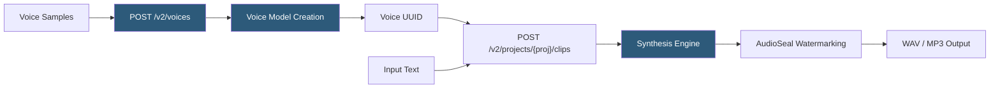

**Category:** Audio & Speech AI Hosting
**Difficulty:** Intermediate
**Reading time:** 5 min read

---

Resemble.ai is an enterprise AI voice platform specializing in high-fidelity voice cloning, real-time speech synthesis, and AI audio watermarking for content provenance. The platform offers rapid voice cloning from short samples via their API, a professional recording studio workflow for high-quality clones, and Resemble Detect — a detection model for identifying AI-generated speech. Resemble targets content creators, enterprise brands, and AI application developers requiring custom branded voices with low latency.

- **Voice UUID** — Unique identifier for each cloned voice in the Resemble API; used in synthesis requests
- **Rapid voice clone** — Zero-shot or few-shot cloning from uploaded audio via the `POST /voices` endpoint
- **Recording studio** — Guided text-prompt recording workflow within the Resemble platform for high-quality voice creation
- **Real-time synthesis** — WebSocket endpoint for streaming TTS with sub-200ms TTFA for conversational applications
- **Resemble Detect** — AI-generated speech detection model available via API for content moderation and provenance verification
- **AudioSeal** — Perceptual audio watermarking technology embedding imperceptible identifiers in synthesized audio
- **Localize** — Resemble's dubbing product that preserves speaker identity across translated language versions
- **Emotional rendering** — Parameter controls for adjusting speaking style and emotional tone in synthesis requests

Resemble's API is organized around Projects (containers for related audio clips), Voices (cloned or built voice models), and Clips (individual synthesis outputs). Voice creation via API submits audio samples to `POST /v2/voices` with a `name` and array of base64-encoded audio segments. The API processes the samples and returns a voice UUID within seconds for zero-shot cloning.

Synthesis requests are submitted to `POST /v2/projects/{project_uuid}/clips` with `body` (input text), `voice_uuid`, `is_async`, `output_format`, and optional `callback_uri` for webhook notification. Synchronous requests return audio immediately for short clips; asynchronous requests return a clip UUID polled via `GET /v2/projects/{proj}/clips/{clip_uuid}`.

The real-time WebSocket API (`wss://app.resemble.ai/stream`) enables streaming synthesis for conversational applications. The client sends a JSON connection payload with API key and voice configuration, then posts text payloads; the server streams PCM audio frames in response. TTFA under 200ms makes this suitable for voice bots where response immediacy is critical.

AudioSeal embeds imperceptible watermarks in synthesized audio during the synthesis pipeline. These watermarks survive compression (MP3), noise addition, and some audio editing operations. Resemble Detect can verify whether audio was generated by Resemble and recover the embedded identifier. This is used by enterprise customers for content provenance tracking and compliance with AI content disclosure requirements.

Resemble's on-premises deployment option (enterprise plan) provides containerized inference services running within customer cloud or data center infrastructure, using the same API contract as the hosted service.

- Brand voice deployment for products requiring custom, consistent voice identity across all touchpoints
- Legal and compliance teams using AudioSeal to establish provenance of AI-generated audio assets
- Conversational AI platforms needing real-time synthesis with sub-200ms TTFA
- Dubbing workflows using Localize to maintain speaker identity across language versions
- Enterprise content security teams using Resemble Detect to screen user-uploaded audio for AI generation

| Advantage | Disadvantage |
|-----------|--------------|
| AudioSeal watermarking provides content provenance for compliance and security | Watermarking may be stripped by aggressive audio editing; not tamper-proof |
| Resemble Detect enables AI speech verification from the same platform | Detection capability only works reliably on Resemble-generated audio |
| On-premises deployment available for data residency requirements | Enterprise pricing required for on-premises and high-volume usage |
| Real-time WebSocket API with sub-200ms TTFA | API design (Projects/Clips) adds organizational overhead versus simpler stateless APIs |

- [ElevenLabs Voice Cloning](elevenlabs-voice-cloning.md)
- [PlayHT AI Voice Generation](playht-ai-voice-generation.md)
- [Descript Overdub](descript-overdub.md)

---
*Part of the [Audio & Speech AI Hosting](index.md) category · [Back to Master Index](../../index.md)*
