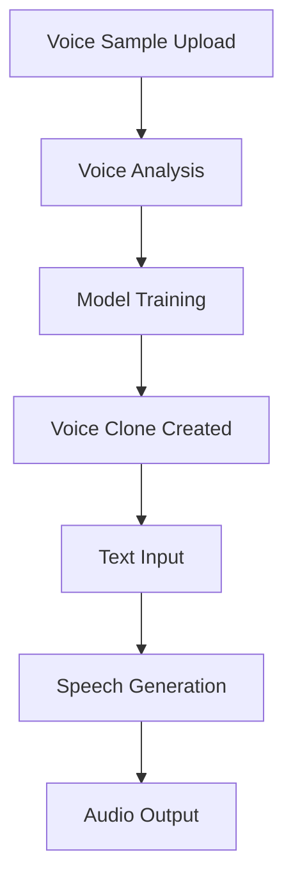

**Category:** Audio & Speech AI Hosting
**Difficulty:** Intermediate
**Reading time:** 6 min read

---

Resemble.ai is an AI voice synthesis platform that creates realistic digital voices from minimal sample audio. It enables brands and creators to generate natural-sounding voice content at scale, supporting multiple languages and voice styles while maintaining speaker identity consistency across applications.

- **Voice Cloning** — creation of a synthetic voice based on a short audio sample (as little as 1-2 minutes)
- **Text-to-Speech Synthesis** — generation of audio from written text using the cloned voice model
- **Multi-Language Support** — ability to generate speech in different languages while maintaining voice characteristics
- **Voice Customization** — adjustment of speech speed, pitch, and emotional tone
- **API Integration** — programmatic access to voice generation for applications and workflows

The platform begins by analyzing uploaded voice samples to extract acoustic characteristics including pitch patterns, formant frequencies, and speaking style. Neural networks trained on large speech corpora learn to replicate these characteristics. Users can then submit text for synthesis, which is encoded and fed through the trained voice model to generate natural-sounding audio. The system supports emotion rendering through inference adjustments that modify prosody and tone. Generated audio can be streamed in real-time or downloaded as files. API endpoints accept text and parameters, returning audio in multiple formats. The service handles multiple concurrent synthesis requests and provides usage tracking and billing based on characters processed.

- Brand voice consistency across customer-facing applications and videos
- Audiobook and content creation with consistent narrator voice
- Personalized voice messages for customer service and IVR systems
- Accessibility features providing natural-sounding voice for text readers
- Game and entertainment character voice synthesis

| Advantage | Disadvantage |
|-----------|--------------|
| Requires minimal training data (1-2 minutes) compared to competitors | Synthetic voice may lack emotional nuance of human performers |
| Natural-sounding results suitable for professional content | Copyright and consent considerations for voice cloning |
| Multi-language synthesis preserves voice characteristics | Quality degrades with noisy or poor-quality training audio |
| Easy API integration with real-time generation | Per-character pricing can add up for high-volume usage |
| Supports emotional tone variation in synthesized speech | Voice licensing and usage rights require careful management |

- [Murf.ai Voice Generator](murfai-voice-generator.md)
- [Text-to-Speech Technology](../../audio-speech-ai-hosting/index.md)
- [Audio Production and Synthesis](../../index.md)

---
*Part of the [Audio & Speech AI Hosting](index.md) category · [Back to Master Index](../../index.md)*
