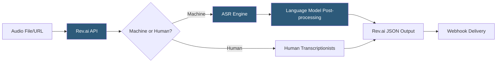

**Category:** Audio & Speech AI Hosting
**Difficulty:** Beginner
**Reading time:** 5 min read

---

Rev.ai is a speech recognition API platform that combines automated AI transcription with optional human review, offering both machine and human-in-the-loop transcription workflows from the same API interface. The machine transcription API provides asynchronous batch and real-time streaming modes, while the human transcription service routes jobs to professional transcriptionists for accuracy-critical use cases. Rev.ai's English accuracy is competitive with top-tier ASR models due to training on data sourced from Rev's large human transcription operation.

- **Asynchronous job** — Submit audio, receive job ID, webhook or poll for completion; standard pattern for batch transcription
- **Streaming endpoint** — WebSocket API for real-time transcription with partial and final results
- **Monologue** — Rev.ai's document model unit; a continuous speech segment attributed to a single speaker
- **Element** — Smallest unit in Rev.ai JSON output; includes type (text or punctuation), value, timestamp, and confidence
- **Speaker channel** — Separate audio channel assignment enabling per-speaker transcription in stereo recordings
- **Custom vocabulary** — User-defined word list submitted to improve recognition of proper nouns and domain terms
- **Human transcription** — Professional transcriptionist service accessible via same API with 99%+ accuracy guarantee
- **Language confidence** — Per-element confidence score enabling downstream filtering of low-confidence words

Rev.ai's machine transcription API follows the standard asynchronous job pattern. Clients POST to `/speechtotext/v1/jobs` with either a `source_config.url` pointing to hosted audio or a direct file upload URL. The response contains a job ID and status `in_progress`. Completion notification arrives via webhook (HTTP POST to a configured URL) or by polling `GET /speechtotext/v1/jobs/{id}`.

Once complete, the transcript is retrieved from `GET /speechtotext/v1/jobs/{id}/transcript`. The default JSON response uses Rev.ai's monologue/element document model: the top-level array contains monologues (speaker turns), each containing an array of elements with type, value, timestamp, end-timestamp, and confidence. This granular structure enables word-level operations like search, highlight, and confidence-based human review routing.

Custom vocabulary is submitted as a list of strings attached to the job request; the language model applies them as soft constraints during decoding. Unlike keyword boosting in some competitors, Rev.ai custom vocabulary affects the full decoding pass rather than just post-processing substitution.

For human transcription, the same API endpoint accepts a `type: human` parameter. The job is routed to Rev.ai's professional transcriptionist network, with turnaround times of hours depending on audio length and queue depth. Human transcripts follow the same JSON schema, enabling interchangeable processing.

Rev.ai's streaming WebSocket follows a similar pattern to other providers: PCM audio at 16 kHz, interim/final result messages, custom vocabulary support at session open.

- Legal transcription services requiring high accuracy with optional human review fallback
- Media production companies creating searchable archives of broadcast content
- Academic research teams transcribing interview recordings with confidence-scored word data
- Accessibility compliance workflows generating captions for pre-recorded video content
- Enterprise platforms needing hybrid AI/human transcription based on content sensitivity

| Advantage | Disadvantage |
|-----------|--------------|
| Human transcription option from same API for accuracy-critical content | Human transcription significantly more expensive and slower than machine |
| Word-level timestamps and confidence in element-based JSON model | Element-based JSON is more complex to parse than flat transcript strings |
| Custom vocabulary improves domain accuracy without fine-tuning | Limited language support compared to Whisper's 99-language coverage |
| Training data from professional human transcription corpus improves accuracy | No on-premises deployment option |

- [AssemblyAI Speech-to-Text](assemblyai-speech-to-text.md)
- [Deepgram Speech Recognition](deepgram-speech-recognition.md)
- [Speaker Diarization Services](speaker-diarization-services.md)

---
*Part of the [Audio & Speech AI Hosting](index.md) category · [Back to Master Index](../../index.md)*
