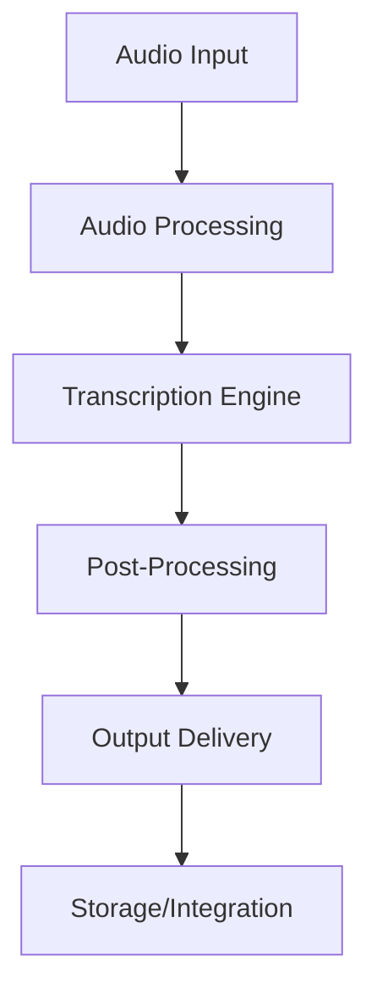

**Category:** Audio & Speech AI Hosting
**Difficulty:** Intermediate
**Reading time:** 6 min read

---

Rev.ai is a cloud-based speech-to-text platform that converts audio and video content into accurate transcriptions using AI. It offers both asynchronous batch processing for high-volume transcription and real-time streaming capabilities, making it suitable for media workflows, accessibility compliance, and voice automation applications.

- **Asynchronous Transcription** — submit audio files for processing and retrieve results after completion, ideal for batch workflows
- **Real-time Streaming** — live transcription of audio streams with millisecond latency, useful for live events and monitoring
- **Speaker Diarization** — automatic identification and labeling of different speakers in audio
- **Custom Vocabulary** — domain-specific terms and proper nouns that can be added to improve accuracy for specialized content
- **Automatic Punctuation** — AI-powered insertion of punctuation marks and capitalization for readability

Rev.ai accepts audio files via HTTP API or webhook submission. Files are queued and processed by distributed transcription engines that convert spoken words into text using deep learning models trained on diverse audio conditions. The service automatically handles audio preprocessing including noise reduction and normalization. Speaker diarization tracks when different speakers begin and end their speech. Post-processing applies custom vocabulary rules, adds punctuation, and structures output with timing information. Results are delivered via downloadable JSON with word-level timestamps, speaker labels, and confidence scores. Integration options include direct API polling, webhooks for completion notification, and SDK libraries for common programming languages.

- Media and podcast publishing with searchable transcripts for SEO
- Meeting and conference recording transcription for compliance and knowledge management
- Video content accessibility via automatic caption generation
- Contact center and customer service call analysis
- Legal and medical document transcription with privacy controls

| Advantage | Disadvantage |
|-----------|--------------|
| High accuracy with specialized models for different audio types | Batch processing has variable latency depending on queue |
| Supports multiple languages and accents | Real-time streaming has higher per-minute costs |
| Flexible pricing based on processing volume | Custom vocabulary requires additional setup and training |
| Easy API integration with webhook support | Noisy audio or heavy accents may reduce accuracy |
| Automatic speaker identification saves manual labeling | Large file uploads may be rate-limited |

- [Audio Processing and Analysis](../../index.md)
- [Speech Recognition Technology](../../audio-speech-ai-hosting/index.md)
- [Resemble.ai Voice Cloning](resemble-ai-voice-cloning.md)

---
*Part of the [Audio & Speech AI Hosting](index.md) category · [Back to Master Index](../../index.md)*
