**Category:** Audio & Speech AI Hosting
**Difficulty:** Advanced
**Reading time:** 7 min read

---

Speaker diarization answers the question "who spoke when" in a multi-speaker audio recording, segmenting the audio timeline into speaker-attributed turns without knowing the speakers' identities in advance. It is a core feature of meeting transcription, call center analytics, and interview archiving systems. Production-quality diarization combines voice activity detection, speaker embedding extraction (x-vectors or d-vectors), clustering (agglomerative, spectral), and resegmentation into a pipeline. Top-performing systems include pyannote.audio 3.x, NeMo Diarization, and cloud APIs from AssemblyAI, Deepgram, and AWS Transcribe.

- **Speaker embedding** — Fixed-dimensional vector representation of speaker identity extracted from short audio segments (x-vectors, d-vectors, ECAPA-TDNN)
- **Clustering** — Grouping embedding vectors from different audio segments into speaker clusters (AHC, spectral clustering, K-means)
- **Resegmentation** — Viterbi-based post-processing that refines segment boundaries using a trained HMM to correct clustering errors
- **DER (Diarization Error Rate)** — Primary evaluation metric; sum of missed speech, false alarm speech, and speaker confusion error divided by total reference speech duration
- **Oracle VAD** — Using ground-truth speech/silence labels during evaluation to isolate diarization error from VAD error
- **Overlap detection** — Identifying segments where multiple speakers talk simultaneously; most systems ignore overlapping speech
- **ECAPA-TDNN** — State-of-the-art speaker embedding model architecture; captures channel and context-dependent speaker features
- **pyannote.audio** — Open-source Python library providing pre-trained diarization pipelines using end-to-end neural approaches

```mermaid
graph LR
    Audio["Multi-speaker Audio"] --> VAD["Voice Activity Detection"]
    VAD --> Segments["Speech Segments"]
    Segments --> Embed["Speaker Embedding Extraction (ECAPA-TDNN)"]
    Embed --> Cluster["Agglomerative Clustering"]
    Cluster --> Labels["Speaker Labels per Segment"]
    Labels --> Reseg["Resegmentation (Viterbi HMM)"]
    Reseg --> Output["Speaker-Labeled Timeline"]
    style Embed fill:#2d5a7a,color:#fff
    style Cluster fill:#2d5a7a,color:#fff
    style Reseg fill:#2d5a7a,color:#fff
```

The diarization pipeline begins with voice activity detection to identify speech regions and discard silence. Speech regions are segmented into short analysis windows (1–3 seconds) with overlap. Each window is passed through a speaker embedding model — ECAPA-TDNN or a similar architecture — that maps the audio to a 192 or 256-dimensional speaker embedding vector. These models are trained on speaker verification tasks using losses like AAM-Softmax, which push embeddings from the same speaker close together and separate different speakers.

The resulting embedding sequence is clustered to group same-speaker segments. Agglomerative Hierarchical Clustering (AHC) with cosine distance is the traditional approach: segments are merged into clusters based on embedding similarity until a stopping criterion (threshold or target speaker count) is reached. Spectral clustering is an alternative that better handles non-convex cluster shapes arising from speaking style variation within a speaker.

The initial clustering provides coarse speaker boundaries. Resegmentation uses a Viterbi algorithm over an HMM whose emission probabilities are provided by a speaker recognition model to realign segment boundaries more precisely. This corrects boundary errors where clustering assigned the tail of one speaker's turn to the wrong cluster.

pyannote.audio 3.x achieves end-to-end diarization using a segmentation model that jointly detects VAD and speaker turns, followed by a clustering step. Its out-of-the-box DER on AMI meeting corpus is typically below 15%, competitive with commercial systems. The library requires a Hugging Face token for model download due to licensing requirements.

Cloud diarization APIs (AssemblyAI `speaker_labels: true`, Deepgram `diarize=true`) return `speaker` fields in transcript word arrays. These are opaque integer labels without speaker identification; across separate recordings, `Speaker 0` is not necessarily the same person.

- Meeting intelligence platforms attributing transcript text to specific participants for minutes generation
- Call center analytics separating agent from customer speech for individual quality metrics
- Legal and court transcription requiring accurate speaker attribution for evidentiary records
- Podcast production tools generating per-speaker chapter markers and speaker-attributed transcripts
- Healthcare documentation systems identifying clinician vs. patient speech in recorded consultations

| Advantage | Disadvantage |
|-----------|--------------|
| pyannote.audio provides production-quality open-source diarization without API costs | DER degrades significantly with more than 5 speakers or short (<30s) per-speaker segments |
| Cloud API diarization integrates seamlessly with transcription in a single request | Speaker labels are anonymous integers; identification requires separate speaker enrollment |
| ECAPA-TDNN embeddings generalize well across recording conditions and accents | Overlapping speech is typically not handled; simultaneous speakers cause attribution errors |
| End-to-end neural diarization eliminates separate VAD tuning requirements | Accurate diarization requires clean, consistent audio; heavy reverberation or noise increases DER |

- [Voice Activity Detection (VAD)](voice-activity-detection-vad.md)
- [AssemblyAI Speech-to-Text](assemblyai-speech-to-text.md)
- [Real-time Audio Processing](real-time-audio-processing.md)

---
*Part of the [Audio & Speech AI Hosting](index.md) category · [Back to Master Index](../../index.md)*
