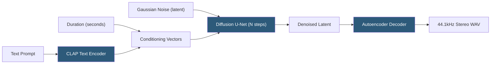

**Category:** Audio & Speech AI Hosting
**Difficulty:** Advanced
**Reading time:** 6 min read

---

Stable Audio is Stability AI's text-to-audio generation model using a latent diffusion architecture conditioned on text prompts and duration specifications, producing up to 95 seconds of stereo audio at 44.1 kHz — higher fidelity and longer duration than competing open-source music generation models. Stable Audio Open, released under an open license for non-commercial use, enables self-hosting of the model weights. The commercial API at stability.ai provides paid access for production workloads.

- **Latent diffusion** — Generative process that applies diffusion in a compressed latent space rather than raw audio, enabling faster and higher-quality generation
- **Autoencoder** — Neural network that compresses audio to a latent representation (encoding) and reconstructs audio from it (decoding); the basis of latent diffusion
- **CLAP (Contrastive Language-Audio Pretraining)** — Audio-text alignment model used by Stable Audio for conditioning text prompts onto the generation process
- **Duration conditioning** — Explicit specification of desired output length (in seconds) as a conditioning signal alongside the text prompt
- **Stable Audio Open** — Non-commercial research release of Stable Audio weights available on Hugging Face
- **Diffusion steps** — Number of denoising iterations during inference; more steps improve quality at higher compute cost
- **Guidance scale** — CFG (classifier-free guidance) scale controlling prompt adherence; values 5–10 typical for music generation
- **44.1 kHz stereo** — CD-quality output sample rate and channel configuration; higher fidelity than MusicGen's 32 kHz mono output

Stable Audio's latent diffusion architecture compresses audio into a compact latent representation using a convolutional autoencoder. This compression (typically 64× temporal reduction) makes diffusion in the latent space computationally feasible: the U-Net denoising network operates on the compressed representation, not on raw audio samples, drastically reducing the sequence length the network must process.

During inference, the process starts with Gaussian noise in the latent space. The diffusion U-Net iteratively denoises this latent over N steps, conditioned on CLAP text embeddings and duration conditioning vectors. CLAP provides semantic audio-text alignment learned from large audio-text datasets, enabling it to understand complex musical descriptions ("upbeat jazz piano with walking bass", "eerie cinematic strings in minor key").

Duration conditioning is a significant advantage over fixed-output-length models. By specifying duration as an explicit conditioning variable (not just truncating longer generation), the model distributes musical events across the requested duration naturally. A 10-second prompt and 90-second prompt of the same description produce structurally appropriate output for each length.

The 44.1 kHz stereo output provides CD-quality audio with spatial information — instrument panning and reverb space are preserved. This makes Stable Audio output directly usable in professional production contexts without upsampling.

For self-hosting Stable Audio Open via the `diffusers` library: `StableAudioPipeline.from_pretrained("stabilityai/stable-audio-open-1.0")` loads the model. An A100 or RTX 3090 (24 GB VRAM) is recommended for full-quality inference; 50 diffusion steps produce good quality for music generation.

- Professional music production platforms integrating 44.1 kHz CD-quality AI music generation
- Sound library generation services creating unique sound effects and textures for licensed use
- Interactive music generation applications where users specify both style and exact duration
- Film and media scoring tools generating mood-specific background music for specific scene lengths
- Research into latent diffusion for audio and comparative evaluation of generative audio architectures

| Advantage | Disadvantage |
|-----------|--------------|
| 44.1 kHz stereo output meets professional production quality requirements | Self-hosting requires ~16 GB VRAM; inference slower than autoregressive models |
| Duration conditioning produces structurally appropriate music for the requested length | Stable Audio Open is non-commercial only; commercial use requires Stability AI API |
| Latent diffusion architecture enables higher fidelity than raw-audio diffusion | Diffusion step count significantly impacts quality; finding optimal steps requires experimentation |
| CLAP text conditioning understands nuanced musical descriptions | Output can lack rhythmic consistency over long durations compared to human composition |

- [AudioCraft Model Hosting](audiocraft-model-hosting.md)
- [MusicGen Model Deployment](musicgen-model-deployment.md)
- [Audio Classification APIs](audio-classification-apis.md)

---
*Part of the [Audio & Speech AI Hosting](index.md) category · [Back to Master Index](../../index.md)*
