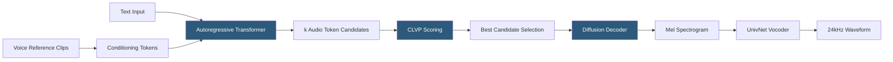

**Category:** Audio & Speech AI Hosting
**Difficulty:** Advanced
**Reading time:** 6 min read

---

Tortoise TTS is an open-source text-to-speech model developed by James Betker that achieves exceptional voice cloning quality from short reference clips using an autoregressive transformer plus a diffusion-based vocoder. It is widely regarded as one of the highest-quality open-source TTS models for voice similarity and naturalness despite its slow inference speed (minutes per sentence on a single GPU). Deployment requires NVIDIA GPU hardware; optimization forks like tortoise-tts-fast improve throughput with quantization and CUDA kernel optimizations.

- **CLVP (Contrastive Language-Voice Pretraining)** — Tortoise's CLIP-like model that scores audio-text alignment to select the best autoregressive generation candidates
- **Autoregressive model** — GPT-style transformer generating discrete audio tokens from text and speaker conditioning tokens
- **Diffusion decoder** — Denoising diffusion model that converts discrete audio tokens to mel spectrograms with high perceptual quality
- **Vocoder** — UnivNet neural vocoder converting mel spectrograms to waveforms
- **Voice conditioning clips** — 2–30 second audio samples from the target speaker used to compute conditioning tokens
- **k (num_autoregressive_samples)** — Number of candidate autoregressive generations scored by CLVP; higher k improves quality but multiplies compute time
- **tortoise-tts-fast** — Community fork with int8 quantization and optimized CUDA kernels for 4–8× speedup
- **Preset mode** — Quality/speed tradeoff presets: `ultra_fast`, `fast`, `standard`, `high_quality` adjusting k and diffusion steps

Tortoise TTS's quality-speed tradeoff is inherent to its architecture. Voice conditioning clips are encoded by a pretrained CLVP encoder into speaker conditioning tokens. The autoregressive model generates `k` candidate sequences of discrete audio tokens conditioned on the text and speaker tokens. CLVP scores each candidate's alignment with the text and speaker conditioning, selecting the top candidate(s) for decoding.

The diffusion decoder refines the selected audio tokens into a mel spectrogram over many denoising steps (default 200 steps). More diffusion steps produce higher quality but take longer. Finally, the UnivNet vocoder synthesizes the waveform from the mel spectrogram.

In `high_quality` preset, `k=256` autoregressive candidates are generated and the top candidate is decoded with 200 diffusion steps — this produces outstanding quality but takes 5–15 minutes per sentence on a single A100. The `ultra_fast` preset sets `k=1` and uses 10 diffusion steps, completing in 30–60 seconds per sentence at reduced quality.

The `tortoise-tts-fast` fork achieves 4–8× speedup through int8 quantization of the autoregressive model (using bitsandbytes), CUDA kernel fusion, and optimized attention implementations. On an A100 GPU, fast mode produces approximately 10–30 seconds of audio per minute of generation time.

For production deployment, Tortoise is typically used as a batch generation system rather than a real-time service — generating audio for fixed scripts, audiobooks, or long-form content where generation time is acceptable. A REST API wrapping the generation function with S3 output storage and SQS job queuing is the standard production pattern.

- Audiobook narration with high-fidelity voice cloning of author or narrator voices
- Character voice generation for animation and games where quality justifies generation time
- Research into diffusion-based audio generation and voice cloning architectures
- Creating a personal voice clone for asynchronous communication accessibility applications
- High-quality TTS asset generation for creative projects not requiring real-time synthesis

| Advantage | Disadvantage |
|-----------|--------------|
| Best-in-class voice cloning quality among open-source TTS models | Extremely slow inference (minutes per sentence in quality mode) |
| Voice cloning from 2–30 second clips without training or fine-tuning | Requires high-VRAM GPU (16+ GB recommended for quality mode) |
| Permissive Apache 2.0 license for commercial use | Complex multi-stage architecture increases deployment operational complexity |
| k/diffusion step tuning provides explicit quality-speed control | Not suitable for real-time or near-real-time applications |

- [Bark Text-to-Audio Model](bark-text-to-audio-model.md)
- [XTTS Voice Synthesis](xtts-voice-synthesis.md)
- [Whisper Model Deployment](whisper-model-deployment.md)

---
*Part of the [Audio & Speech AI Hosting](index.md) category · [Back to Master Index](../../index.md)*
