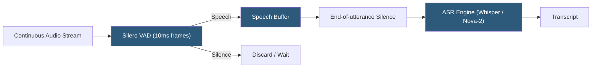

**Category:** Audio & Speech AI Hosting
**Difficulty:** Intermediate
**Reading time:** 6 min read

---

Voice Activity Detection (VAD) is the process of classifying audio frames as speech or non-speech, enabling downstream systems to activate only when a speaker is present. VAD is a fundamental component of ASR pipelines, audio recording systems, conferencing software, and IoT voice interfaces. Leading implementations include WebRTC VAD (rule-based, ultra-fast), Silero VAD (neural, high accuracy), and py-webrtcvad (Python WebRTC VAD bindings). VAD directly impacts ASR accuracy by preventing non-speech audio frames from confusing decoder models.

- **Speech probability** — Per-frame output from neural VAD models indicating the probability (0–1) that the frame contains speech
- **Aggressiveness** — WebRTC VAD mode parameter (0–3) controlling sensitivity; higher values reduce false positives at cost of missing soft speech
- **Chunking** — Using VAD to identify speech boundaries for splitting long audio into individual utterance segments before ASR
- **Silero VAD** — PyTorch-based neural VAD model from the Silero team; runs at real-time on CPU with high accuracy in noisy conditions
- **WebRTC VAD** — GMM-based VAD from Google's WebRTC project; extremely fast (sub-millisecond) but less accurate than neural models in challenging noise
- **Padding** — Adding silence frames before/after detected speech to prevent cutting off speech onset/offset
- **Hysteresis** — Speech/silence state transitions requiring multiple consecutive frames of the same class before switching, reducing rapid toggling
- **Energy threshold** — Simple baseline VAD using short-term RMS energy; works in clean environments but fails with background noise

VAD systems operate on short fixed-length audio frames (typically 10–30ms). For each frame, the VAD classifies it as speech or silence based on extracted features. Simple energy-based VAD computes the root mean square energy of the frame and applies a threshold; this fails when background noise is intermittently above the threshold.

WebRTC VAD uses a Gaussian Mixture Model (GMM) approach: it models the distribution of spectral features for speech and noise separately and classifies frames using likelihood ratios. This handles stationary noise better than energy thresholds but struggles with music, crowd noise, and other complex non-speech sounds.

Silero VAD uses an LSTM-based neural network trained on a large corpus of speech and diverse non-speech sounds. It accepts 30ms audio frames at 16 kHz (or 8 kHz) and outputs a speech probability float. Applying a threshold (e.g., 0.5) converts probabilities to binary classification. Hysteresis is applied in post-processing: requiring 3 consecutive non-speech frames before declaring silence prevents cutting mid-phoneme transitions. Silero VAD runs in real time on a single CPU core at approximately 1ms per 30ms frame.

For ASR preprocessing, VAD serves two roles: real-time gating (only sending speech frames to the streaming ASR WebSocket, reducing API costs) and chunking (splitting recordings into utterance segments at silence boundaries before batch ASR, enabling parallel processing of independent segments).

The `pyannote.audio` library provides a VAD model alongside its speaker diarization pipeline, enabling combined VAD and speaker turn detection in a single pipeline call.

- ASR cost reduction by skipping silence frames in pay-per-minute streaming transcription APIs
- Wake word systems using VAD as a first stage to activate keyword detection only during speech
- Audio recording systems that begin capturing only when speech is detected (telephone hold message skip)
- Podcast editing tools automatically detecting and trimming silence gaps between speaker turns
- IoT voice interface devices using VAD to gate cloud API calls, reducing latency and network usage

| Advantage | Disadvantage |
|-----------|--------------|
| Silero VAD achieves high accuracy in noisy conditions at CPU real-time | Aggressive VAD truncates soft-onset speech (whispers, fading sentence endings) |
| WebRTC VAD provides sub-millisecond classification for ultra-low-latency pipelines | Silence padding adds latency to utterance detection; aggressive padding increases API costs |
| VAD gating can reduce ASR API costs by 40–60% for audio with significant silence | Music and complex non-speech sounds can trigger false positive speech detection |
| Open-source models with no per-call API costs | Threshold tuning required per deployment environment and background noise profile |

- [Real-time Audio Processing](real-time-audio-processing.md)
- [Speaker Diarization Services](speaker-diarization-services.md)
- [Deepgram Streaming API](deepgram-streaming-api.md)

---
*Part of the [Audio & Speech AI Hosting](index.md) category · [Back to Master Index](../../index.md)*
