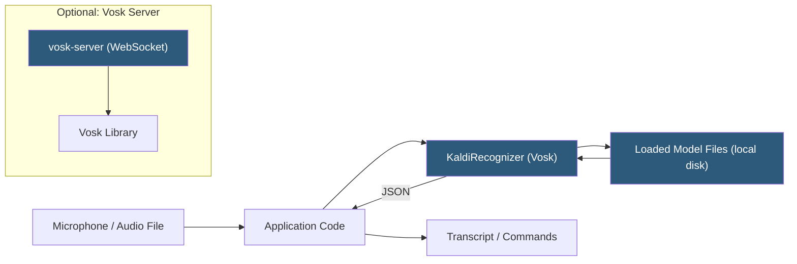

**Category:** Audio & Speech AI Hosting
**Difficulty:** Intermediate
**Reading time:** 5 min read

---

Vosk is an open-source offline speech recognition toolkit supporting 20+ languages with pre-built models ranging from 50 MB to 1.8 GB, enabling deployment on servers, desktops, Raspberry Pi, Android, and iOS without internet connectivity. Built on Kaldi ASR framework with optimizations for embedded systems, Vosk provides Python, Java, Node.js, C#, and C++ bindings plus a standalone server mode. Its offline-first design makes it ideal for privacy-sensitive applications, air-gapped environments, and edge devices where cloud API latency is unacceptable.

- **Kaldi** — Open-source speech recognition framework that Vosk extends with simpler APIs and pre-packaged models
- **Model files** — Pre-trained language and acoustic model bundle downloaded and loaded at application startup
- **KaldiRecognizer** — Core Vosk class that accepts PCM audio chunks and returns JSON transcription results
- **Partial result** — Incomplete in-progress transcription returned while audio is being processed
- **Final result** — Committed transcript segment emitted after silence detection or stream close
- **Speaker model** — Optional x-vector speaker embedding model enabling speaker identification and diarization
- **Grammar mode** — Restricted vocabulary mode accepting a JSON array of allowed phrases for command-and-control applications
- **Vosk Server** — Standalone WebSocket server providing network-accessible ASR endpoint from local Vosk installation

Vosk wraps the Kaldi speech recognition framework behind clean language bindings. Deployment begins with downloading a pre-trained model bundle from the Vosk model repository and loading it into a `Model` object at application startup. Model loading is a one-time cost (several seconds for large models); subsequent recognitions reuse the loaded model in memory.

Recognition is streaming-oriented: the application feeds PCM audio chunks (any size, typically 4000 bytes at 16 kHz) to a `KaldiRecognizer` instance via `AcceptWaveform()`. The recognizer maintains internal state across calls, accumulating audio features and running the Kaldi decoder. `PartialResult()` returns the current best hypothesis as JSON; calling `FinalResult()` or detecting silence via `AcceptWaveform()` returning True commits the current segment.

Vosk uses Kaldi's TDNN-F (Time Delay Neural Network with Factorization) acoustic models combined with HCLG finite-state transducer decoding graphs. The FST graph encodes the acoustic model, pronunciation lexicon, and n-gram language model in a compiled searchable structure. Decoding is fast because the FST is traversed rather than evaluated dynamically, enabling real-time performance on single CPU cores.

The Vosk Server component exposes a WebSocket endpoint accepting PCM audio from any client, returning JSON partial and final transcripts. This enables language-agnostic integration: browsers, mobile apps, and IoT devices connect via standard WebSocket without needing language-specific Vosk bindings.

For embedded deployment, Vosk's small models (50 MB lightweight tier) run on Raspberry Pi 4 in real time at ~0.5× real-time factor on the ARM Cortex-A72, drawing less than 5W.

- Air-gapped industrial control systems with voice command interfaces
- Privacy-preserving medical or legal transcription processing audio locally
- Raspberry Pi and Arduino-class devices with voice activation features
- Mobile applications requiring offline voice control without cloud dependency
- Kiosk and embedded systems in locations without reliable internet connectivity

| Advantage | Disadvantage |
|-----------|--------------|
| Fully offline; zero data transmission and no API costs | Accuracy below modern cloud foundation models on conversational audio |
| 20+ language models available pre-trained | Model files must be managed and updated manually |
| Runs on CPU without GPU; minimal hardware requirements | Limited to Kaldi-based architectures; cannot leverage transformer improvements without retraining |
| Grammar mode restricts vocabulary for high-accuracy command recognition | Speaker diarization requires separate speaker model and additional configuration |

- [Mozilla DeepSpeech Hosting](mozilla-deepspeech-hosting.md)
- [Coqui STT Platform](coqui-stt-platform.md)
- [Voice Activity Detection (VAD)](voice-activity-detection-vad.md)

---
*Part of the [Audio & Speech AI Hosting](index.md) category · [Back to Master Index](../../index.md)*
