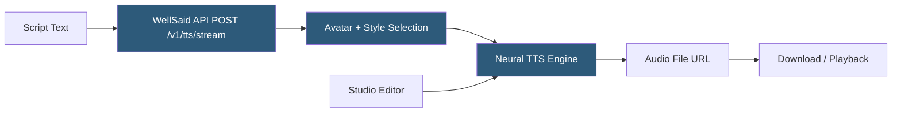

**Category:** Audio & Speech AI Hosting
**Difficulty:** Intermediate
**Reading time:** 5 min read

---

WellSaid Labs is an enterprise-focused AI text-to-speech platform built on a foundation of explicitly consented voice actor recordings, offering a curated library of studio-quality voices for corporate learning, marketing, and media production. The platform prioritizes ethical AI voice creation with transparent voice actor partnerships and provides an API and studio editor for production workflows. WellSaid targets enterprise content teams producing high volumes of professional narration who need consistent voice quality and a legally defensible content creation process.

- **Avatar** — WellSaid's term for an AI voice; each avatar is based on a consented voice actor recording
- **Speaking style** — Per-avatar delivery variations (conversational, promotional, narrative) reflecting different recorded performances
- **Studio editor** — Browser-based script-to-audio production tool with project management and team collaboration
- **WellSaid API** — REST API for programmatic synthesis; returns audio URLs rather than streaming bytes
- **Script markers** — In-editor tags for controlling pronunciation, pacing, and emphasis within synthesis requests
- **Async rendering** — API synthesis model where requests return a job ID and audio is retrieved from a URL when complete
- **Team workspace** — Multi-user account environment with shared avatar access and project organization
- **SOC 2 compliance** — WellSaid's security certification relevant to enterprise procurement and vendor evaluation

WellSaid Labs voices (Avatars) are trained exclusively on recordings made by voice actors who explicitly consented to AI synthesis use, receive compensation for their recordings, and retain approval rights over use cases. This positions WellSaid as a premium ethical choice for enterprises concerned about AI voice consent liability.

The WellSaid API endpoint `POST /v1/tts/stream` accepts JSON with `text`, `speaker_id` (avatar ID), and `speaking_rate`. The name "stream" is somewhat misleading — this endpoint initiates an async synthesis job and returns a streaming response with audio bytes. For the async API (`POST /v1/tts/job`), the response includes a job ID; the audio URL is retrieved via `GET /v1/tts/job/{id}` when the status is `complete`.

The studio editor provides a script-based workflow: paste or type script text into a panel, select an avatar and style, and click to synthesize. Multiple script lines can be synthesized and sequenced on a basic timeline. The editor supports pronunciation markers (phonetic respellings embedded inline in script text) and pause markers for controlling silence duration.

WellSaid's platform targets L&D (learning and development) teams producing e-learning content, marketing teams creating consistent brand voice content at scale, and video production teams using AI narration for explainer videos and corporate communications.

Enterprise plans include volume discounts, SSO integration, dedicated support, and SLA guarantees. Security documentation including SOC 2 Type II reports is available for enterprise procurement processes.

- Corporate learning and development teams producing thousands of e-learning module narrations
- Enterprise brand consistency — generating all marketing audio assets in a single branded voice
- Video production agencies creating consistent client voiceovers across project portfolios
- Financial services and healthcare companies requiring documented ethical AI voice sourcing
- Internal communications teams converting memos and announcements to audio for audio-first channels

| Advantage | Disadvantage |
|-----------|--------------|
| Fully consented voice actor catalog provides ethical and legal certainty | Smaller avatar catalog than platforms with unconsented or synthetic-only voices |
| SOC 2 compliance documentation supports enterprise security reviews | Higher cost per character than competitors due to voice actor royalty model |
| Studio editor requires no technical expertise for production teams | API returns audio URLs rather than streaming bytes; adds latency for real-time use cases |
| Consistent voice quality across all avatars; curated rather than large-but-uneven catalog | Limited multilingual support compared to Google, Azure, and Amazon |

- [Murf.ai Voice Generator](murf-ai-voice-generator.md)
- [Replica Studios Voice AI](replica-studios-voice-ai.md)
- [ElevenLabs Text-to-Speech](elevenlabs-text-to-speech.md)

---
*Part of the [Audio & Speech AI Hosting](index.md) category · [Back to Master Index](../../index.md)*
