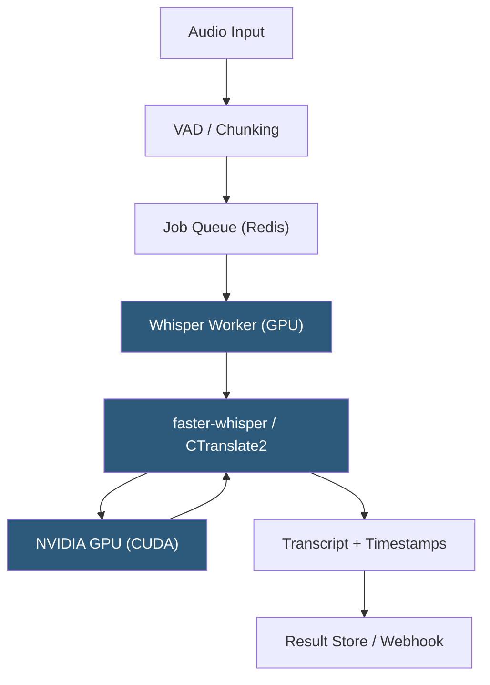

**Category:** Audio & Speech AI Hosting
**Difficulty:** Advanced
**Reading time:** 7 min read

---

Self-hosting OpenAI's Whisper model gives teams full control over audio data privacy, enables custom fine-tuning, and eliminates per-minute API costs at scale. Deployment options range from CPU-only servers for low-volume workloads to GPU-accelerated inference servers using optimized runtimes like faster-whisper (CTranslate2) or WhisperX for word-level alignment. Serving frameworks such as Triton Inference Server, BentoML, or simple FastAPI wrappers can expose the model as a scalable REST endpoint.

- **faster-whisper** — CTranslate2-based reimplementation of Whisper offering 4× faster inference at lower memory footprint via quantization
- **CTranslate2** — C++ inference engine for transformer models with int8 quantization support for CPU and GPU
- **WhisperX** — Extension adding forced phoneme-level alignment using wav2vec2, enabling accurate word timestamps
- **Model size tiers** — tiny (39M params), base (74M), small (244M), medium (769M), large (1.5B), large-v3 (1.5B improved)
- **CUDA** — NVIDIA GPU compute platform required for GPU-accelerated inference; cuDNN libraries must match CUDA version
- **Batch inference** — Processing multiple audio segments simultaneously to maximize GPU utilization
- **VAD preprocessing** — Silero or WebRTC VAD to strip silence before inference, reducing compute per audio minute
- **ONNX export** — Converting Whisper weights to ONNX format for deployment on non-PyTorch runtimes

Deploying Whisper self-hosted requires selecting a model size, runtime, and serving architecture. For production, `faster-whisper` with the `large-v3` model is the standard choice: CTranslate2 applies int8 quantization, reducing the model from 3 GB float32 to ~1 GB int8, enabling it to fit on a single A10G GPU with headroom for batching.

The serving pattern uses a job queue (Redis, RabbitMQ) to decouple audio ingestion from inference. Audio files are uploaded to object storage (S3, GCS), and a job message containing the object key is enqueued. Whisper workers pull jobs, download audio, run VAD to split into sub-30-second chunks, and process each chunk through the CTranslate2 inference engine. Chunk results are stitched in order and returned via webhook or stored in a results database.

VAD preprocessing with Silero VAD eliminates silence padding, which otherwise wastes inference cycles on non-speech audio. For podcast or meeting recordings (often 40–50% silence), this can halve GPU time per audio hour.

For GPU batch inference, the Whisper encoder processes multiple chunks in parallel using padded batch tensors. The decoder operates autoregressively per sequence, so encoder batching provides more speedup than decoder batching. A single A100 80GB can process roughly 100× real-time audio with `large-v3` int8 when batching 16 chunks simultaneously.

Container deployment uses Docker with NVIDIA CUDA base images; Kubernetes with GPU node pools (A10G, A100, H100) and GPU resource limits per pod scales worker fleets automatically.

- High-volume transcription services where per-minute API costs are prohibitive
- Organizations with strict data residency requirements prohibiting cloud API audio transmission
- Custom vocabulary fine-tuning for specialized domains (legal, medical, financial)
- Real-time caption generation requiring sub-second latency on local hardware
- Research environments needing access to intermediate model activations and embeddings

| Advantage | Disadvantage |
|-----------|--------------|
| Zero per-request cost at high volume | Significant GPU infrastructure investment and ongoing ops burden |
| Full data privacy; audio never leaves your infrastructure | Model updates require manual redeployment and regression testing |
| Custom fine-tuning and vocabulary adaptation possible | GPU memory management and CUDA version compatibility complexity |
| Flexible output formats and post-processing pipelines | Scaling requires GPU autoscaling infrastructure (Kubernetes + cluster autoscaler) |

- [OpenAI Whisper API](openai-whisper-api.md)
- [AssemblyAI Speech-to-Text](assemblyai-speech-to-text.md)
- [Real-time Audio Processing](real-time-audio-processing.md)

---
*Part of the [Audio & Speech AI Hosting](index.md) category · [Back to Master Index](../../index.md)*
