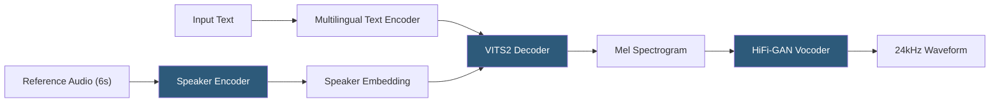

**Category:** Audio & Speech AI Hosting
**Difficulty:** Advanced
**Reading time:** 6 min read

---

XTTS (Cross-lingual Text-to-Speech) is an open-source multilingual voice synthesis model from Coqui that performs zero-shot voice cloning from a 6-second reference audio clip across 17 languages, combining the flexibility of voice cloning with multilingual synthesis in a single model. XTTS v2, released in 2023, achieves near-commercial quality for many languages and is the flagship model of the Coqui TTS library. Although Coqui Inc. shut down in 2024, XTTS remains actively used in self-hosted deployments.

- **Zero-shot voice cloning** — Cloning a speaker's voice from a short reference audio clip without any model fine-tuning
- **Cross-lingual synthesis** — Synthesizing speech in a different language than the reference audio language while preserving the speaker's voice characteristics
- **Speaker conditioning** — Process of extracting voice characteristics from the reference clip and conditioning the synthesis model
- **VITS2 architecture** — Variational Inference TTS backbone used in XTTS for high-quality synthesis
- **Speaker encoder** — Component extracting fixed-dimensional speaker embedding vectors from reference audio
- **Coqui TTS library** — Python library providing XTTS and other TTS model interfaces under a unified API
- **Streaming synthesis** — XTTS feature generating audio chunk-by-chunk for reduced time-to-first-audio
- **XTTS fine-tuning** — Training an XTTS checkpoint on additional audio data to improve quality for a specific speaker or language

XTTS v2 is accessed via the Coqui TTS Python library (`TTS` package from PyPI). Instantiating the model downloads approximately 1.8 GB of model weights. Synthesis requires a `text` string, a `language` code, and `speaker_wav` (path to the reference audio file). The model automatically resamples the reference audio to its required sample rate and extracts a speaker embedding.

The speaker encoder is a pretrained model that maps variable-length audio to a fixed 512-dimensional embedding vector capturing voice timbre, accent, and speaking style. This embedding conditions the VITS2 synthesis network, which generates mel spectrograms autoregressively. A HiFi-GAN vocoder converts spectrograms to 24 kHz waveforms.

Cross-lingual synthesis is one of XTTS's most powerful features. A reference audio in English can condition synthesis in Spanish, French, German, or 14 other languages while preserving the speaker's voice characteristics. The model's multilingual training enables language transfer without language-specific per-voice training.

Streaming synthesis (`tts_to_file` with streaming enabled) generates and returns audio in chunks as they are produced rather than waiting for full synthesis. This reduces time-to-first-audio from several seconds to under a second for short texts, enabling near-real-time applications with acceptable first-chunk latency.

Hardware requirements: XTTS v2 requires approximately 6 GB VRAM for comfortable GPU synthesis at full quality. CPU inference is possible but slow (3–5× real-time factor on modern CPUs). An RTX 3090 or A10G achieves approximately 1.5–2× real-time synthesis throughput.

- Multilingual voice applications requiring a single reference audio clip to synthesize in multiple languages
- Self-hosted voice cloning for privacy-sensitive applications where cloud APIs are inappropriate
- Game and interactive media requiring dynamic NPC speech with character voice consistency
- Research into cross-lingual voice transfer and multilingual TTS model architectures
- Accessible communication tools generating personalized synthesized voice from short recordings

| Advantage | Disadvantage |
|-----------|--------------|
| Zero-shot voice cloning from 6 seconds; no training required | Coqui Inc. shut down; active maintenance now community-driven |
| Cross-lingual synthesis from single reference audio | Quality varies across languages; English and major European languages are strongest |
| Streaming mode reduces time-to-first-audio significantly | Requires 6 GB VRAM; not suitable for low-resource deployment |
| Coqui TTS library provides unified interface across multiple models | Speaker similarity degrades for cross-lingual synthesis versus same-language |

- [Tortoise TTS Deployment](tortoise-tts-deployment.md)
- [Bark Text-to-Audio Model](bark-text-to-audio-model.md)
- [Coqui STT Platform](coqui-stt-platform.md)

---
*Part of the [Audio & Speech AI Hosting](index.md) category · [Back to Master Index](../../index.md)*
