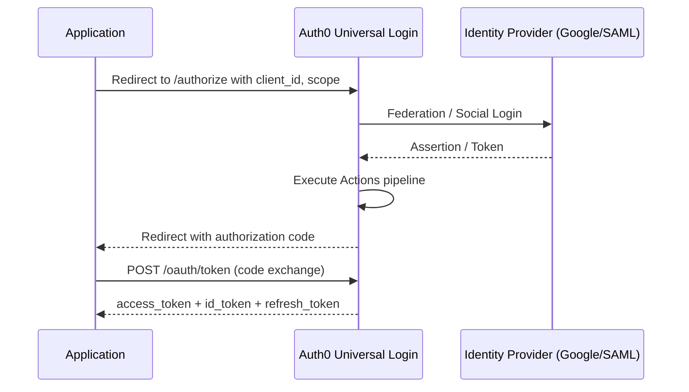

**Category:** Authentication & Identity Platforms
**Difficulty:** Intermediate
**Reading time:** 6 min read

---

Auth0 is a cloud-based identity-as-a-service (IDaaS) platform providing authentication, authorization, and user management for web, mobile, and API applications. Acquired by Okta in 2021, Auth0 remains a separate product targeting developers who need to add secure authentication without building identity infrastructure. The platform supports OAuth 2.0, OIDC, SAML, and LDAP protocols, and abstracts social login, MFA, anomaly detection, and user management behind a well-documented SDK and management API.

- **Tenant** — Isolated Auth0 environment containing applications, connections, and users; maps to a single organization's identity domain
- **Application** — OAuth 2.0 client registered in Auth0; defines allowed callback URLs, token settings, and grant types
- **Connection** — Identity source configured in Auth0 (database, social provider, enterprise SAML, LDAP)
- **Universal Login** — Auth0-hosted login page rendered at `{tenant}.auth0.com`; customizable with branding, theming, and Actions
- **Access Token** — JWT issued after successful authentication; contains claims used to authorize API calls
- **ID Token** — OIDC JWT containing user profile claims returned to the client application
- **Rules / Actions** — JavaScript/Node.js functions executing in the authentication pipeline to add claims, enforce MFA, or route users
- **Management API** — REST API for programmatically managing users, connections, roles, and tenant configuration

Auth0 implements the OAuth 2.0 Authorization Code Flow with PKCE as the recommended pattern for browser and mobile applications. When a user initiates login, the application redirects to Auth0's `/authorize` endpoint with `client_id`, `redirect_uri`, `scope` (including `openid`), `state`, and `code_challenge` (PKCE). Auth0 renders Universal Login, which handles credential entry, MFA challenges, and social/enterprise federated login.

After successful authentication through any configured Connection (database password, Google OAuth, SAML enterprise IdP), Auth0 executes the Actions pipeline — a sequence of serverless Node.js functions that run at specific trigger points: pre-login, post-login, credentials exchange. Actions can add custom claims to tokens, enforce MFA enrollment, query external databases for authorization context, or deny login based on risk signals.

The authorization code is returned to the application's redirect URI. The application exchanges the code for tokens via a server-side POST to `/oauth/token`, receiving an `access_token` (JWT for API authorization), `id_token` (JWT with user profile), and optionally a `refresh_token`. Token lifetime, rotation, and absolute expiry are configured per application in the Auth0 dashboard.

Auth0's anomaly detection engine analyzes login patterns and blocks suspicious activity (credential stuffing, brute force) automatically. The Management API (`https://your-tenant.auth0.com/api/v2/`) enables programmatic user CRUD, role assignment, and connection management for administrative workflows.

- SaaS applications adding multi-tenant SSO with per-customer SAML/OIDC enterprise connections
- Consumer apps requiring social login (Google, Facebook, Apple) with minimal development time
- API platforms issuing JWT access tokens for machine-to-machine authentication
- Regulated industries using Auth0's SOC 2/ISO 27001 compliance for authentication infrastructure
- Mobile applications implementing secure authentication without building token management

| Advantage | Disadvantage |
|-----------|--------------|
| Comprehensive SDK coverage (React, Angular, Vue, iOS, Android, .NET, Python) | Pricing scales steeply with MAU; enterprise features require negotiated pricing |
| Actions pipeline provides extensible customization without forking the platform | Tenant isolation means tenant-level features are shared; per-organization customization requires Organizations feature |
| Universal Login reduces CSRF/XSS surface versus self-hosted login forms | Cold start latency on Actions can add 50–200ms to login flows |
| Built-in anomaly detection, MFA, and bot protection | Vendor lock-in; migrating users and configuration to another platform is complex |

- [Auth0 Universal Login](auth0-universal-login.md)
- [Auth0 Organizations](auth0-organizations.md)
- [Okta Customer Identity](okta-customer-identity.md)

---
*Part of the [Authentication & Identity Platforms](index.md) category · [Back to Master Index](../../index.md)*
