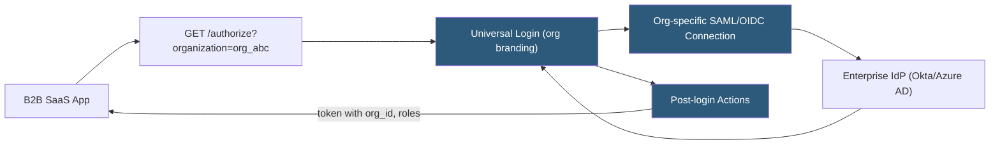

**Category:** Authentication & Identity Platforms
**Difficulty:** Advanced
**Reading time:** 6 min read

---

Auth0 Organizations is a feature enabling B2B SaaS applications to represent their enterprise customers as distinct organizational units within a single Auth0 tenant, each with independent member management, SSO connections, branding, and login policies. Rather than creating separate Auth0 tenants per customer, Organizations allows the application to manage multi-tenancy within one tenant, simplifying administration while supporting per-organization SAML/OIDC enterprise SSO connections and custom branding.

- **Organization** — Named entity in Auth0 representing a customer company; has its own members, connections, roles, and metadata
- **Organization member** — User associated with an organization; can have organization-specific roles distinct from global user roles
- **Organization connection** — An identity connection (SAML, OIDC, database) enabled for a specific organization
- **Invitation** — Email-based workflow inviting users to join an organization; generates a one-time URL for account setup
- **Organization roles** — RBAC roles scoped to an organization; appear in access tokens when the user authenticates via that org
- **Branding** — Per-organization logo and colors overriding tenant defaults in Universal Login
- **`org_id` claim** — JWT claim containing the organization ID; included in tokens when authentication occurs via an organization
- **Prompt organization selection** — Login flow variant showing an organization picker when users belong to multiple organizations

Organizations are created via the Auth0 Dashboard or Management API (`POST /api/v2/organizations`). Each Organization has a unique identifier (`org_id`) and name. Connections are enabled per-organization: a SAML connection for Acme Corp is only active when users authenticate via Acme's organization URL or when the application passes `organization=org_acme_id` in the `/authorize` request.

When the `/authorize` request includes an `organization` parameter, Universal Login applies the organization's branding (logo, colors) and restricts authentication to that organization's enabled connections. This ensures Acme Corp users see Acme's branding and can only log in via Acme's enterprise IdP — not via Google or database connections unless those are also enabled for Acme.

Organization members are managed via the Management API: `POST /api/v2/organizations/{id}/members` adds existing Auth0 users to an organization. The invitation flow creates an invitation token sent via email; the invited user clicks the link, creates or links their account, and becomes an organization member. This is the primary onboarding path for new users joining a customer organization.

Organization roles are defined per-organization and assigned to members. When a user authenticates via an organization, their organization roles are included in the access token as `org_roles` claims. Post-login Actions can access the organization context (`event.organization`) to implement custom authorization logic based on the specific organization.

The `org_id` claim in the access token allows the SaaS application's backend to enforce organization-scoped data access: requests to the API are validated to ensure the `org_id` claim matches the requested resource's organization, preventing cross-tenant data access.

- B2B SaaS platforms managing enterprise customer SSO without separate Auth0 tenants per customer
- Marketplace applications where each seller organization has independent user management
- SaaS products offering per-customer SAML connections with per-organization branding
- Enterprise software requiring organization-scoped RBAC where roles vary per customer
- Multi-tenant applications onboarding new enterprise customers via invitation workflows

| Advantage | Disadvantage |
|-----------|--------------|
| Single Auth0 tenant supports unlimited organizations without tenant proliferation | Organizations feature requires Enterprise Auth0 plan; not available on free or developer plans |
| Per-organization SAML/OIDC connections without manual connection routing code | Per-organization branding limited to logo and colors; full custom themes require custom domains |
| Management API enables automation of organization and member provisioning | `org_id` claim handling in application RBAC logic adds development complexity |
| Invitation workflows provide structured user onboarding without custom email handling | Organization member limits apply per plan; very large enterprise deployments require negotiation |

- [Auth0 Identity Platform](auth0-identity-platform.md)
- [Auth0 Universal Login](auth0-universal-login.md)
- [Auth0 Actions Customization](auth0-actions-customization.md)

---
*Part of the [Authentication & Identity Platforms](index.md) category · [Back to Master Index](../../index.md)*
