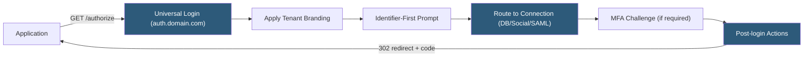

**Category:** Authentication & Identity Platforms
**Difficulty:** Intermediate
**Reading time:** 5 min read

---

Auth0 Universal Login is the centralized, Auth0-hosted login page that handles all authentication interactions for applications registered in an Auth0 tenant. By delegating login UI to Auth0's domain rather than embedding it within the application, Universal Login eliminates common authentication vulnerabilities and provides a single place to configure MFA, social connections, branding, and login policies. The New Universal Login experience supports full theming via the Dashboard, while Classic Universal Login allows HTML/CSS/JS template customization.

- **New Universal Login** — Template-free, React-based login experience configured via Dashboard theme editor and tenant-level settings
- **Classic Universal Login** — Customizable HTML/CSS/JS templates with direct DOM manipulation; deprecated in favor of New UL
- **Login box** — The UI widget shown to users; supports username/password, social buttons, passkeys, and MFA challenges
- **Identifier First** — Login flow variant showing username/email input before password, enabling connection routing based on domain
- **Prompt** — OAuth 2.0 `prompt` parameter controlling whether Universal Login forces re-authentication (`login`) or skips if session exists (`none`)
- **Custom Domains** — Serving Universal Login from your own domain (e.g., `auth.yourdomain.com`) instead of Auth0's subdomain
- **Branding API** — Programmatic interface for configuring tenant logo, colors, and font applied to Universal Login
- **Organizations login prompt** — Login flow that pre-selects or prompts for organization selection before authentication

Universal Login is served by Auth0's infrastructure at the tenant's domain (e.g., `your-tenant.auth0.com`) or a configured custom domain. When the application redirects to `/authorize`, Auth0 checks for an existing SSO session cookie. If a valid session exists and `prompt=none` is requested, the authorization code is returned immediately without showing the login page. If no session exists or `prompt=login` is specified, the login UI is rendered.

The New Universal Login renders a React-based login widget styled using the Dashboard's Branding > Universal Login > Widget configuration. Colors, logo, font family, and widget border radius are configurable. For more granular control, Advanced Customization allows injecting CSS and custom footer HTML. Full template replacement (as in Classic UL) is not supported in New UL.

Identifier-First login flow is enabled in tenant settings and shows the email/username field on a first screen, then routes to the appropriate second screen based on the domain. Enterprise users with an email matching a SAML connection domain are redirected to the enterprise IdP; database users proceed to password entry. This provides a smooth HRD (Home Realm Discovery) experience.

Custom domains map your brand's subdomain (`auth.yourdomain.com`) to Auth0's infrastructure via a CNAME and TLS certificate managed by Auth0 or supplied by the customer. Custom domains eliminate the `auth0.com` domain from appearing in the browser address bar, strengthening brand trust.

Login policies (passwordless, passkey, concurrent session limits) are configured in the Dashboard's authentication settings and apply globally to all Universal Login sessions.

- B2B SaaS platforms requiring branded login pages with enterprise SSO from a custom domain
- Consumer applications using passwordless or social login without managing session state
- Multi-tenant applications routing enterprise users to per-tenant SAML IdPs automatically
- Regulated industries requiring centralized MFA enforcement across all applications
- Security-focused teams eliminating credential handling from application code entirely

| Advantage | Disadvantage |
|-----------|--------------|
| Eliminates credential handling from application code, reducing XSS/CSRF risk | New Universal Login has limited template customization compared to Classic UL |
| Single configuration point for MFA, social login, and branding across all apps | Custom domain setup requires DNS changes and certificate management |
| SSO session shared automatically across applications in the same tenant | Network round-trip to Auth0 servers on every login; latency depends on region selection |
| Auth0 manages security updates to the login page infrastructure | Branding customization limited to widget-level settings without full HTML control |

- [Auth0 Identity Platform](auth0-identity-platform.md)
- [Auth0 Organizations](auth0-organizations.md)
- [Auth0 Actions Customization](auth0-actions-customization.md)

---
*Part of the [Authentication & Identity Platforms](index.md) category · [Back to Master Index](../../index.md)*
