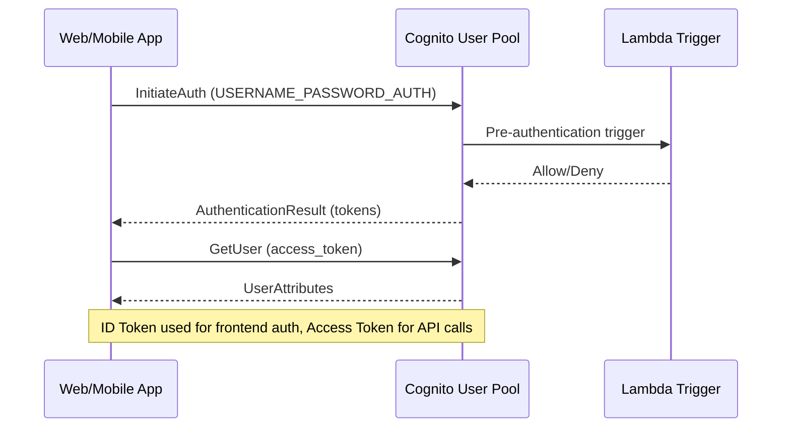

**Category:** Authentication & Identity Platforms
**Difficulty:** Intermediate
**Reading time:** 6 min read

---

AWS Cognito User Pools is a managed user directory and authentication service that provides sign-up, sign-in, and account management for web and mobile applications. User Pools issue JWT tokens (ID, access, refresh) after successful authentication and can be integrated with API Gateway and Application Load Balancer for native JWT authorization. As an AWS-native service, Cognito integrates deeply with IAM, Lambda, and the broader AWS ecosystem, making it the natural choice for applications already running on AWS.

- **User Pool** — A managed user directory containing registered users with configurable password policies, MFA settings, and attribute schemas
- **App client** — An OAuth 2.0 client registered within a User Pool; configures allowed flows, callback URLs, and scopes
- **Hosted UI** — Cognito's pre-built login/signup page served from the User Pool's domain
- **Lambda triggers** — AWS Lambda functions invoked at specific points in the Cognito flow (pre-signup, post-confirmation, pre-token-generation, custom authentication)
- **Custom attributes** — User-defined profile attributes added to the User Pool schema; mutable or immutable, string or number types
- **Identity federation** — Configuring external social (Google, Facebook, Apple) or SAML/OIDC enterprise IdPs in the User Pool
- **Pre-token-generation Lambda trigger** — Lambda invoked before token issuance; can add/suppress claims in the ID and access tokens
- **Cognito token** — JWT tokens issued by Cognito; access tokens authorize API calls, ID tokens contain user profile claims

User Pools are created in the AWS Console or via CloudFormation/CDK with configuration for password policies (minimum length, complexity requirements), MFA settings (SMS, TOTP, optional/required), user attribute schemas, and verification methods (email, phone). The User Pool generates an issuer URL (`https://cognito-idp.{region}.amazonaws.com/{poolId}`) used to validate JWT signatures.

Authentication is performed via the Cognito Identity Service Provider API. The `InitiateAuth` call accepts the `AUTH_FLOW` type (USER_PASSWORD_AUTH for direct password authentication, USER_SRP_AUTH for SRP-based flow where passwords are never sent to the server, REFRESH_TOKEN_AUTH for token refresh) and credentials. The response includes JWT tokens if authentication is successful, or an auth challenge (NEW_PASSWORD_REQUIRED, MFA_SETUP) that must be resolved.

Lambda triggers extend User Pool behavior at key points:
- `pre-sign-up`: validate custom registration logic, auto-confirm users
- `post-confirmation`: trigger downstream provisioning (database user creation, welcome email)
- `pre-token-generation`: add custom claims to ID/access tokens by modifying the `claimsAndScopeOverrideDetails` in the Lambda response
- `define-auth-challenge` + `create-auth-challenge` + `verify-auth-challenge-response`: implement fully custom authentication flows (magic links, custom OTP)

The Hosted UI provides a pre-built login page served at `{prefix}.auth.{region}.amazoncognito.com`. It supports social federation, custom branding via CSS, and SAML IdP integration. For custom login UI, the Cognito SDK is used client-side with direct API calls.

API Gateway and ALB support native Cognito JWT authorization without Lambda authorizers: specifying the User Pool as the authorizer automatically validates JWT signatures and expiry.

- AWS-native web and mobile applications requiring user authentication without external identity services
- Serverless applications on AWS Lambda + API Gateway using Cognito as the JWT authority
- Applications requiring custom authentication flows (magic links, gamification challenges) via Lambda triggers
- Multi-tenant SaaS on AWS with separate User Pools per tenant for complete isolation
- Applications integrating with enterprise SSO via Cognito's SAML federation support

| Advantage | Disadvantage |
|-----------|--------------|
| Native API Gateway/ALB integration without custom Lambda authorizers | User Pool schemas are immutable after creation; required attributes cannot be changed post-creation |
| Lambda triggers enable highly customized authentication without third-party platforms | Hosted UI customization is limited to CSS; no custom HTML or JavaScript supported |
| Scales automatically; no infrastructure to manage | Cognito API rate limits (e.g., 120 `InitiateAuth` calls/second per User Pool) can constrain high-traffic apps |
| MAU-based pricing with generous free tier (50,000 MAU) | Cross-region User Pool replication is not natively supported; global deployments require complex patterns |

- [Cognito Identity Pools](cognito-identity-pools.md)
- [Cognito Hosted UI](cognito-hosted-ui.md)
- [Auth0 Identity Platform](auth0-identity-platform.md)

---
*Part of the [Authentication & Identity Platforms](index.md) category · [Back to Master Index](../../index.md)*
