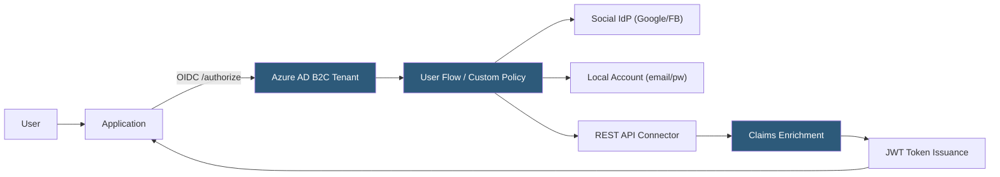

**Category:** Authentication & Identity Platforms
**Difficulty:** Intermediate
**Reading time:** 6 min read

---

Azure Active Directory B2C (Azure AD B2C) is Microsoft's CIAM platform providing consumer and partner authentication for applications with customizable user journeys, social identity federation, and enterprise SSO via SAML and OIDC. Unlike Azure AD (for workforce/internal users), Azure AD B2C is optimized for external user registration, login, and profile management at scale. Custom Policies (Identity Experience Framework) enable fully programmable authentication flows, while User Flows provide pre-built journey templates for common scenarios.

- **Tenant** — Dedicated Azure AD B2C directory isolated from the organization's Azure AD tenant; contains users, applications, and policies
- **User Flow** — Pre-built, configuration-driven authentication journey (sign-up/sign-in, password reset, profile edit) manageable from the Azure portal
- **Custom Policy** — XML-based Identity Experience Framework (IEF) configuration enabling complex, fully customizable authentication flows
- **Technical Profile** — Reusable building block in Custom Policies defining interactions with identity providers, claims transformations, and UI elements
- **Identity Experience Framework (IEF)** — Okta's engine for executing Custom Policy XML files
- **Social identity provider** — External OAuth 2.0/OIDC providers (Google, Facebook, Microsoft) federated into B2C
- **Custom HTML pages** — HTML templates served from a user-controlled CDN for complete UI customization of login/registration pages
- **Local account** — User account stored directly in the B2C tenant with email/username and password

Azure AD B2C organizes authentication around User Journeys — sequences of orchestration steps that collect user input, validate credentials, and issue tokens. User Flows expose a small set of configurable journeys without XML authoring; they handle the most common scenarios (sign-up/sign-in combined flow, password reset, profile edit).

Custom Policies (IEF) are XML files that define fully custom journeys. A policy inherits from a base policy (Microsoft's starter packs), overrides Technical Profiles to change behavior, and defines Orchestration Steps in order. Each step can collect claims (display user input), validate claims (call REST API, validate passwords), or transform claims (combine first/last name into display name). This XML-based approach has a steep learning curve but enables scenarios impossible in User Flows: custom MFA flows, fraud score checking, multi-step registration with external validation.

REST API connectors (available in User Flows) and REST Technical Profiles (in Custom Policies) call external HTTP endpoints during the flow. Use cases include: validating invitation codes, looking up user data from an external CRM, or blocking registration from specific email domains.

Custom HTML pages allow full UI control: upload HTML templates to a CORS-enabled Azure Blob Storage container and configure the User Flow or Custom Policy to use these pages. The B2C JavaScript API injects form fields into a `
` placeholder in the custom HTML, giving complete control over layout, branding, and supplementary content while B2C handles form validation and submission.

B2C scales to hundreds of millions of user accounts; Microsoft publishes SLAs of 99.9% uptime. Pricing is per-MAU with tiers for MFA authentication events.

- Microsoft 365/Azure-centric organizations extending identity to customer-facing apps without a separate CIAM platform
- Applications requiring complete white-label login UI through custom HTML page hosting
- Complex B2C journeys with external API validation during registration (invitation codes, pre-screening)
- Organizations with compliance requirements met by Azure's compliance portfolio (ISO 27001, HIPAA, FedRAMP)
- European organizations requiring GDPR-compliant data residency within Azure EU regions

| Advantage | Disadvantage |
|-----------|--------------|
| Custom Policies (IEF) enable fully programmable authentication flows | Custom Policy XML has steep learning curve; limited tooling and debugging support |
| Custom HTML hosting enables complete white-label login UI | User Flows and Custom Policies are separate systems; migrating between them is complex |
| Azure compliance portfolio covers most regulated industry requirements | Separate B2C tenant from enterprise Azure AD adds administration complexity |
| Scales to hundreds of millions of users with Microsoft's infrastructure | REST API connector latency during user flows affects login experience |

- [Azure AD B2B Collaboration](azure-ad-b2b-collaboration.md)
- [Okta Customer Identity](okta-customer-identity.md)
- [Auth0 Identity Platform](auth0-identity-platform.md)

---
*Part of the [Authentication & Identity Platforms](index.md) category · [Back to Master Index](../../index.md)*
