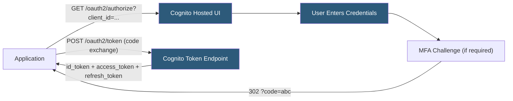

**Category:** Authentication & Identity Platforms
**Difficulty:** Beginner
**Reading time:** 5 min read

---

Cognito Hosted UI is AWS Cognito's pre-built, managed login page served from a Cognito-assigned domain or custom domain, providing sign-in, sign-up, forgot-password, and MFA challenge flows without building custom login UI. Hosted UI implements the OAuth 2.0 Authorization Code flow, returning authorization codes to configured callback URLs that applications exchange for Cognito JWTs. Basic CSS customization allows adding logos and changing colors, while advanced customization requires an upstream proxy or fully custom login UI.

- **Cognito domain** — Auto-assigned subdomain (`{prefix}.auth.{region}.amazoncognito.com`) serving the Hosted UI
- **Custom domain** — Bring-your-own subdomain (e.g., `auth.yourdomain.com`) served via CloudFront with ACM certificate
- **OAuth 2.0 endpoints** — Hosted UI exposes `/oauth2/authorize`, `/oauth2/token`, `/oauth2/logout`, and `/oauth2/userInfo`
- **Callback URL** — Application URL registered in the App Client that receives the authorization code after login
- **CSS customization** — Single CSS file upload that styles the Hosted UI widget (limited to colors, fonts, logo placement)
- **Federation** — Configured social or enterprise IdP connections appear as login options in the Hosted UI
- **`response_type=code`** — Authorization Code flow parameter; Hosted UI redirects to callback URL with `?code=` parameter
- **PKCE** — Proof Key for Code Exchange; adds security to public client authorization code exchanges

Hosted UI is activated by configuring a domain for the User Pool (either a Cognito-managed subdomain or a custom domain). The application redirects users to `https://{domain}/oauth2/authorize` with parameters: `client_id`, `redirect_uri`, `response_type=code`, `scope`, and optional `identity_provider` (to skip the Hosted UI provider selection screen and go directly to a specific IdP).

Hosted UI renders a login form based on the User Pool's configured authentication methods: username/password, email OTP, or federated provider buttons for any enabled social/SAML connections. After successful authentication, Hosted UI redirects to the `redirect_uri` with an `?code=` query parameter. The application server exchanges the code for tokens via `POST /oauth2/token` with `grant_type=authorization_code` and `code_verifier` (PKCE).

CSS customization replaces the default Cognito styling: upload a CSS file in the Console under App clients > Hosted UI > Customize. The file can override color variables, fonts, and add a logo image URL. HTML structure and JavaScript behavior cannot be customized; only styling is addressable. For white-label requirements, a custom domain at minimum is required to remove the `amazoncognito.com` domain from the browser address bar.

The logout endpoint (`/logout?client_id=...&logout_uri=...`) clears the Cognito SSO session cookie and redirects to the configured logout URL. Applications should also invalidate their own session after logout to complete the full sign-out.

Social federation adds provider buttons to the Hosted UI automatically when Google, Facebook, Apple, or other OIDC/SAML providers are configured in the User Pool's federation settings.

- Rapid prototyping of applications needing authentication without building login UI
- Internal tools accepting corporate SSO via SAML with minimal UI customization requirements
- AWS-native applications where Cognito ecosystem consistency outweighs login page flexibility
- Applications transitioning from custom login forms to OAuth 2.0 Authorization Code flow
- Development and staging environments needing functional authentication without production UI investment

| Advantage | Disadvantage |
|-----------|--------------|
| Zero UI development required; functional login flow in minutes | CSS-only customization is extremely limited; custom HTML requires a proxy or custom UI |
| Cognito manages security updates to the login page | Custom domain requires ACM certificate in us-east-1 specifically, regardless of app region |
| Built-in forgot-password and MFA challenge flows without custom implementation | Hosted UI does not support React or custom JavaScript; interactivity is fixed |
| Federation buttons for social/enterprise providers appear automatically | Deprecated LEGACY flow; some older Cognito features not available in hosted UI context |

- [AWS Cognito User Pools](aws-cognito-user-pools.md)
- [Cognito Identity Pools](cognito-identity-pools.md)
- [Auth0 Universal Login](auth0-universal-login.md)

---
*Part of the [Authentication & Identity Platforms](index.md) category · [Back to Master Index](../../index.md)*
