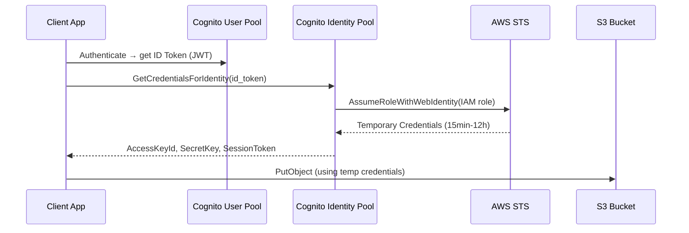

**Category:** Authentication & Identity Platforms
**Difficulty:** Advanced
**Reading time:** 6 min read

---

AWS Cognito Identity Pools (formerly Federated Identities) provide temporary AWS credentials to authenticated and unauthenticated users, enabling direct access to AWS services (S3, DynamoDB, Lambda, IoT) from client applications without routing through a backend API. Identity Pools work with authenticated identities from User Pools, social providers, SAML IdPs, or any OIDC provider, mapping them to IAM roles that define what AWS resources the user can access.

- **Identity Pool** — AWS resource that maps external authenticated identities to IAM roles for credential issuance
- **Authenticated role** — IAM role assumed by users who have successfully authenticated via a configured identity provider
- **Unauthenticated role** — IAM role for guest users accessing the application without authentication; typically limited permissions
- **STS (Security Token Service)** — AWS service that issues temporary IAM credentials (access key, secret key, session token) to Identity Pool users
- **Enhanced flow** — Simplified credential exchange using `GetCredentialsForIdentity`; recommended for most use cases
- **Basic flow** — Two-step process using `GetId` then `AssumeRoleWithWebIdentity`; required for advanced role selection
- **Role mapping** — Configuring Identity Pool to assign different IAM roles based on JWT claims (groups, attributes) from the identity provider
- **Identity ID** — Unique Cognito-assigned identifier for each federated user; persists across authentication provider changes

Identity Pools receive identity tokens (JWT from User Pools, social provider tokens, SAML assertions) and exchange them for temporary IAM credentials. The enhanced flow's `GetCredentialsForIdentity` call combines identity lookup and credential issuance into a single API call. The Identity Pool validates the token with the issuer, determines the appropriate IAM role via role mapping rules, calls STS `AssumeRoleWithWebIdentity`, and returns the credentials to the client.

The temporary credentials have a configurable duration (15 minutes to 12 hours). IAM policies attached to the authenticated role define what AWS services and resources the user can access. Resource-based policies in services like S3 and DynamoDB can further scope access using the `${cognito-identity.amazonaws.com:sub}` condition key, which maps to the user's Cognito identity ID. This pattern enables per-user S3 prefixes: `s3:GetObject` allowed only on `arn:aws:s3:::my-bucket/${cognito-identity.amazonaws.com:sub}/*`.

Role selection with token claims enables assigning different IAM roles to different user groups. If the authenticated user's JWT contains a `cognito:groups` claim with value `["admin"]`, the Identity Pool can map this to a higher-privilege admin IAM role versus the standard user role for all other users. Multiple role mappings are evaluated in order; the first match determines the role.

Unauthenticated access allows guest users to assume a limited-permission IAM role without authentication, enabling scenarios like reading public content from S3 or submitting analytics events to Kinesis without requiring registration.

- Mobile applications uploading user photos directly to S3 with per-user prefix isolation without a backend upload service
- IoT applications assigning AWS IoT certificates to authenticated users for device provisioning
- Real-time applications subscribing to user-specific AppSync subscriptions or IoT MQTT topics
- Games requiring authenticated access to DynamoDB game state tables scoped per user
- Analytics pipelines allowing client apps to write directly to Kinesis without a backend ingestion API

| Advantage | Disadvantage |
|-----------|--------------|
| Direct AWS service access eliminates backend API proxying overhead | Temporary credentials expire; clients must implement refresh logic before credentials expire |
| Per-user IAM scoping enables fine-grained resource isolation at the AWS policy level | IAM policy complexity increases when combining Identity Pool conditions with resource-based policies |
| Unauthenticated access supports progressive registration patterns | Debugging IAM permission errors requires CloudTrail analysis; errors are often opaque to clients |
| Works with any OIDC-compatible identity provider, not just Cognito User Pools | Enhanced flow requires JWT from a supported provider; custom auth systems need OIDC wrapper |

- [AWS Cognito User Pools](aws-cognito-user-pools.md)
- [Cognito Hosted UI](cognito-hosted-ui.md)
- [Okta API Access Management](okta-api-access-management.md)

---
*Part of the [Authentication & Identity Platforms](index.md) category · [Back to Master Index](../../index.md)*
