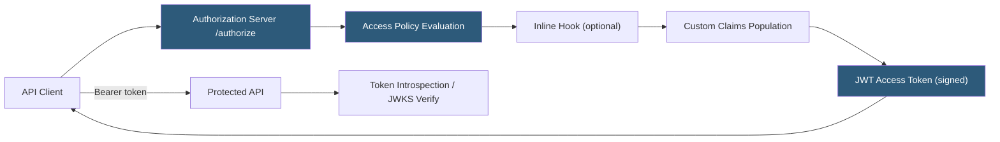

**Category:** Authentication & Identity Platforms
**Difficulty:** Advanced
**Reading time:** 6 min read

---

Okta API Access Management (API AM) is an OAuth 2.0 authorization server built into the Okta platform, enabling organizations to centralize API security policies, issue scoped access tokens, and enforce fine-grained authorization across internal and external APIs. Rather than building custom OAuth 2.0 servers per application, Okta API AM provides a policy-driven token issuance layer that integrates with Okta's identity data and adaptive security signals. The feature includes a default authorization server and supports multiple custom authorization servers for different API audiences.

- **Authorization Server** — Okta-hosted OAuth 2.0 server that issues access tokens; each server has its own issuer URI, signing keys, and token policies
- **Custom Authorization Server** — User-defined authorization server with custom scopes, claims, and policies; separate from the default Okta Authorization Server
- **Scope** — OAuth 2.0 permission string representing an API capability; clients request scopes, authorization servers grant them based on policies
- **Access Policy** — Rules defining which clients and users can receive which scopes; evaluated at token issuance time
- **Inline Hook** — HTTP callback invoked during token issuance to enrich tokens with claims from external systems
- **Token introspection** — OAuth 2.0 RFC 7662 endpoint enabling resource servers to validate and inspect access tokens
- **PKCE** — Proof Key for Code Exchange; required for public clients (SPA, mobile) to prevent authorization code interception
- **Client Credentials flow** — Machine-to-machine OAuth 2.0 flow for server-to-server API access without user context

Okta API AM organizes access control around authorization servers. The default authorization server is automatically provisioned for every Okta org; custom authorization servers support separate audiences, scopes, and claim configurations for different API domains (e.g., one server for a payments API, another for a messaging API).

Scopes are defined per authorization server with names (e.g., `read:orders`), descriptions, and consent display text. Access policies chain rules evaluated in order: "For client_id X with scope Y, allow if user is in group Z." Rules match clients, grant types, and user attributes to determine whether a scope is granted.

Custom claims are mapped from user profile attributes, group memberships, or Inline Hooks. Static claims map Okta profile attributes directly (e.g., `email`, `groups`). Inline Hook claims make an HTTP call to an external service during token issuance; the service returns additional claim key-value pairs that Okta includes in the token. This enables enriching tokens with data not in Okta's directory (e.g., subscription tier from a billing system).

APIs validate tokens using either token introspection (calling Okta's `/introspect` endpoint, which handles revocation checking) or local JWT validation using the authorization server's JWKS endpoint (public keys for signature verification). Local validation is faster and reduces dependency on Okta's availability; introspection handles token revocation at the cost of an additional HTTP round-trip per request.

The Client Credentials flow enables service-to-service API access. A service registers as an Okta application with the `client_credentials` grant type and is assigned scopes via access policies. Services exchange their `client_id` and `client_secret` for access tokens without user interaction.

- Centralizing OAuth 2.0 token issuance for microservices APIs across an enterprise
- Enforcing scope-based access control on internal APIs using Okta user group membership
- Issuing tokens for third-party API consumers with per-client scope restrictions
- Machine-to-machine service authorization using Client Credentials flow with Okta as the authority
- Enriching API access tokens with billing or subscription data via Inline Hook external service calls

| Advantage | Disadvantage |
|-----------|--------------|
| Centralized scope and policy management across all APIs in one Okta tenant | Custom Authorization Servers require API Access Management add-on (additional cost) |
| Inline Hooks enable dynamic claim enrichment without rebuilding Okta configuration | Inline Hook failures during token issuance can block login/token issuance flows |
| JWKS-based local JWT validation reduces latency versus introspection | Token revocation detection requires introspection; local validation does not catch revoked tokens |
| Integrates with Okta's existing group and profile data for claims without additional databases | Not suitable for fine-grained resource-level authorization; Okta AM is a token issuance layer |

- [Okta Workforce Identity](okta-workforce-identity.md)
- [Okta Customer Identity](okta-customer-identity.md)
- [Auth0 Identity Platform](auth0-identity-platform.md)

---
*Part of the [Authentication & Identity Platforms](index.md) category · [Back to Master Index](../../index.md)*
