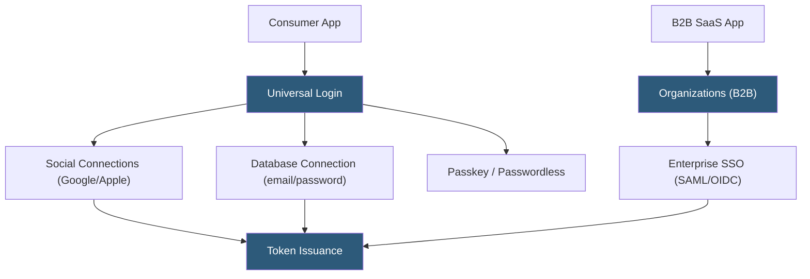

**Category:** Authentication & Identity Platforms
**Difficulty:** Intermediate
**Reading time:** 6 min read

---

Okta Customer Identity Cloud (formerly Auth0) and Okta Customer Identity for Developers provide CIAM (Customer Identity and Access Management) solutions for consumer and B2B customer-facing applications. Distinct from Okta's Workforce Identity product, Customer Identity focuses on scalable authentication for millions of external users with features like progressive profiling, self-service account management, and B2B multi-tenancy. The platform is built on Auth0's technology stack following Okta's 2021 acquisition.

- **CIAM** — Customer Identity and Access Management; specialized IAM for external-facing user populations with unique scale and UX requirements
- **Progressive profiling** — Collecting additional user information across multiple login sessions rather than at registration, reducing friction
- **Universal Login** — Hosted login page serving as the single authentication entry point for all customer-facing applications
- **Social connections** — Pre-built OAuth 2.0 integrations with Google, Facebook, Apple, Microsoft, and 30+ other providers
- **Enterprise connections** — SAML 2.0 and OIDC federated login for B2B customers using corporate identity providers
- **Adaptive MFA** — Risk-based MFA that triggers additional verification only when login signals indicate elevated risk
- **Token Endpoint** — OAuth 2.0 `/oauth/token` endpoint for token issuance, refresh, and revocation
- **Customer Identity pricing** — MAU-based (Monthly Active Users) pricing where charges scale with the number of unique authenticated users per month

Okta Customer Identity Cloud (built on Auth0) serves two primary use cases differentiated by their user populations. For consumer applications, the platform manages millions of users with social login, email/password, and passwordless authentication, with MAU-based pricing that scales with active user counts rather than total registered users.

For B2B applications, the Organizations feature enables representing enterprise customers as distinct organizational units with per-customer SSO connections. The application passes `organization=org_id` in the authorization request, routing enterprise users to their employer's IdP while database users use standard email/password authentication.

Adaptive MFA evaluates risk signals on each authentication: new device, unusual location, bot patterns, and credential breach detection. When risk is elevated, additional factors (TOTP, SMS OTP, push notification via Okta Verify) are requested. For low-risk authentications from recognized devices, MFA is skipped to minimize user friction.

Progressive profiling collects additional user attributes over time rather than requiring all information at registration. After initial social login, the application can prompt for additional fields (phone number, company name, preferences) on subsequent logins or as part of specific workflows, using Actions to gate the user until required fields are provided.

Okta Customer Identity differs from Okta Workforce Identity in several key ways: CIAM includes higher MAU limits before enterprise pricing, is optimized for external user registration flows, and includes B2C features (social login, progressive profiling) absent from the Workforce product.

- E-commerce platforms providing social login and guest checkout with progressive profile completion
- Media streaming services authenticating millions of subscribers with MAU-based cost predictability
- B2B SaaS applications providing enterprise SSO for corporate customers via Organizations
- Healthcare consumer apps requiring HIPAA-compliant authentication with adaptive MFA
- Fintech applications using risk-based authentication to balance security and conversion rates

| Advantage | Disadvantage |
|-----------|--------------|
| MAU pricing aligns cost with actual usage rather than registered user count | MAU pricing spikes unpredictably with viral growth or seasonal traffic surges |
| Unified CIAM platform handles both B2C social login and B2B enterprise SSO | Overlap with Okta Workforce creates confusion; sales teams may push inappropriate products |
| Adaptive MFA reduces friction for low-risk users while protecting high-risk sessions | Feature set inherited from Auth0; some Okta-native integrations work better with Workforce |
| Progressive profiling improves conversion by deferring data collection | Organizations feature requires enterprise plan; not accessible on free or developer tiers |

- [Okta Workforce Identity](okta-workforce-identity.md)
- [Auth0 Identity Platform](auth0-identity-platform.md)
- [Auth0 Organizations](auth0-organizations.md)

---
*Part of the [Authentication & Identity Platforms](index.md) category · [Back to Master Index](../../index.md)*
