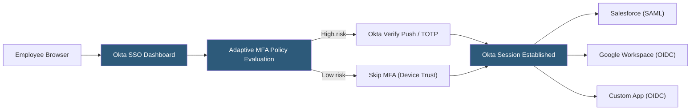

**Category:** Authentication & Identity Platforms
**Difficulty:** Intermediate
**Reading time:** 6 min read

---

Okta Workforce Identity is an enterprise IAM platform managing employee, contractor, and partner identity across cloud applications, on-premises systems, and custom applications. It provides single sign-on (SSO), lifecycle management (provisioning/deprovisioning via SCIM), adaptive MFA, and a universal directory that serves as the authoritative identity source for the entire technology stack. Okta's integration network covers 7,000+ pre-built application connectors, making it the dominant workforce IAM platform in cloud-first enterprises.

- **Universal Directory** — Okta's centralized user store supporting multiple profile attributes, custom attribute schemas, and mastering from authoritative sources (HR systems, Active Directory)
- **SCIM (System for Cross-domain Identity Management)** — Standard protocol for automating user provisioning and deprovisioning to connected applications
- **SSO (Single Sign-On)** — Users authenticate to Okta once and access all connected applications without re-entering credentials
- **Lifecycle Management** — Automated user account provisioning at hire, attribute updates during employment, and deprovisioning at termination
- **Okta Verify** — Okta's authenticator app providing push notifications, TOTP, and FastPass (device-based authentication)
- **Device Trust** — Policy enforcement requiring authentication from managed/compliant devices (MDM-enrolled)
- **FastPass** — Passwordless authentication using device-bound cryptographic credentials; integrates with Okta Verify
- **Adaptive MFA policies** — Risk-based authentication rules evaluating device, network, user behavior to adjust MFA requirements

Okta Workforce Identity centers on the Universal Directory as the identity source of truth. Organizations connect HR systems (Workday, BambooHR) to Okta via import rules: when a new employee is created in the HRIS, Okta imports the profile, creates the user account, and triggers lifecycle management workflows that provision the user to all appropriate applications.

SCIM 2.0 is the provisioning protocol for modern SaaS applications: Okta acts as the SCIM client, pushing user create/update/deactivate operations to SCIM-enabled applications. For applications without SCIM, Okta Agent-based provisioning or password sync can extend lifecycle management to legacy systems.

The Okta Integration Network (OIN) provides pre-tested application connectors configured with SAML or OIDC metadata. Administrators enable an application from the OIN catalog, configure attribute mappings, and assign user groups — the SSO and provisioning configuration is handled by the pre-built connector rather than requiring custom SAML setup.

Adaptive MFA policies evaluate authentication risk using signals including: device enrollment and compliance status (MDM), network origin (corporate network vs. VPN vs. public internet), user behavior anomalies (unusual location, time of day), and threat intelligence feeds. High-risk authentications trigger step-up MFA; trusted devices from corporate networks may skip MFA based on policy.

Okta FastPass enables passwordless authentication: Okta Verify on enrolled devices stores a device-bound private key. During authentication, the Okta server challenges the device, which signs the challenge with the private key in the secure enclave. No password is transmitted, and the private key never leaves the device.

- Enterprise-wide SSO consolidation replacing per-application password management
- Zero Trust network access implementation using Device Trust and adaptive MFA policies
- Mergers and acquisitions — federating acquired company's Active Directory into Okta for immediate SSO
- Compliance-driven identity governance requiring auditable access certification and lifecycle management
- Passwordless enterprise rollout using FastPass and Okta Verify for phishing-resistant authentication

| Advantage | Disadvantage |
|-----------|--------------|
| 7,000+ OIN application connectors reduce per-app SSO configuration work | Premium pricing; Okta is among the most expensive IAM platforms |
| SCIM-based lifecycle management automates provisioning across the entire app portfolio | Complex policy configuration; misconfigured adaptive MFA can lock out users |
| Universal Directory supports hybrid identity (cloud + AD) without full AD replacement | Okta outages (rare but notable) cascade to all SSO-dependent applications |
| FastPass provides phishing-resistant passwordless authentication without hardware keys | Migration from a competing IAM platform is complex; Okta's data portability is limited |

- [Okta Customer Identity](okta-customer-identity.md)
- [Okta API Access Management](okta-api-access-management.md)
- [Azure Active Directory B2C](azure-active-directory-b2c.md)

---
*Part of the [Authentication & Identity Platforms](index.md) category · [Back to Master Index](../../index.md)*
