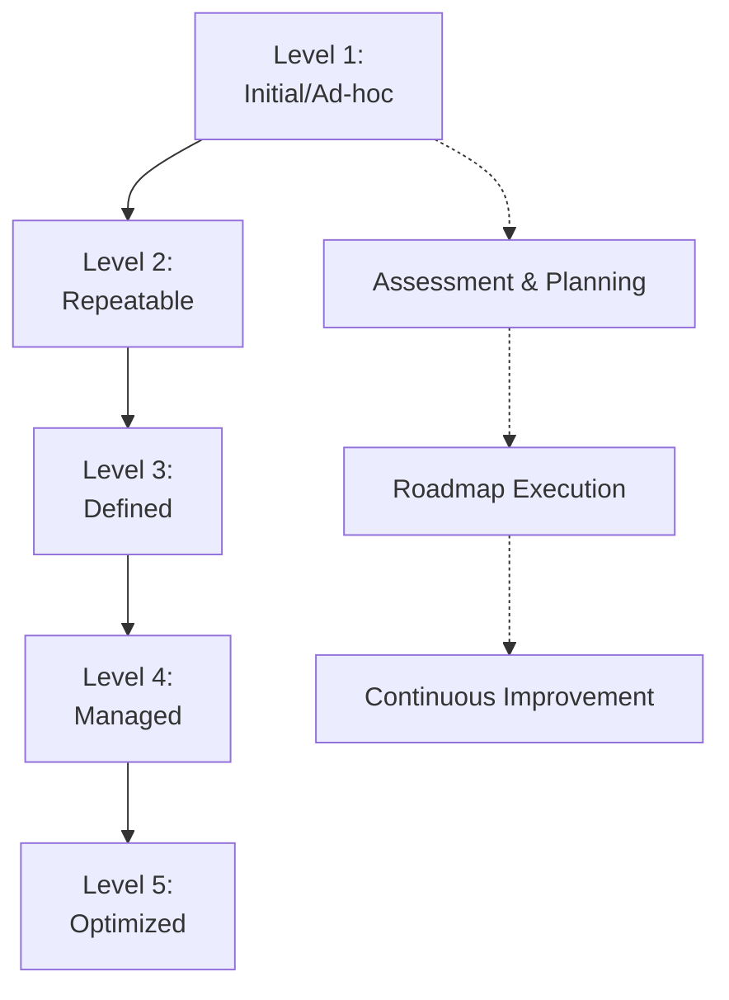

**Category:** Automation Best Practices & Governance
**Difficulty:** Intermediate
**Reading time:** 6 min read

---

This lesson covers automation maturity models, frameworks that assess an organization's capability and sophistication in implementing and managing automation initiatives. Maturity models provide structured approaches to measuring progress from ad-hoc automation toward enterprise-wide automation platforms.

- **Maturity Levels** — Typically 5 levels from initial/ad-hoc to optimized/continuous improvement
- **Assessment Criteria** — Dimensions like governance, testing, documentation, and monitoring
- **Capability Mapping** — Identifying gaps between current and desired automation state
- **Roadmap Development** — Using assessments to plan automation transformation
- **Best Practices Alignment** — Alignment with industry standards and proven approaches

Automation maturity models typically define 5 levels of organizational capability. Level 1 (Initial) features unpredictable, hero-dependent automation efforts. Level 2 (Repeatable) introduces documentation and reuse. Level 3 (Defined) establishes standards, governance, and training. Level 4 (Managed) includes metrics, monitoring, and process management. Level 5 (Optimized) emphasizes continuous improvement, innovation, and automation. Organizations assess their current state across dimensions like process management, infrastructure, people/skills, governance, and metrics. The assessment reveals gaps and prioritizes improvement initiatives. Progress typically spans 2-5 years depending on organizational readiness and investment levels.

- Assessing current automation capabilities
- Planning automation transformation initiatives
- Setting realistic timelines for improvements
- Prioritizing investments in automation infrastructure
- Benchmarking against industry peers
- Creating automation training programs
- Building business cases for automation investments

| Advantage | Disadvantage |
|-----------|--------------|
| Structured approach to improvement | Models may not fit all organizations |
| Clear progression path | Progress can be slow (2-5 years) |
| Measurable milestones | Requires significant organizational change |
| Industry-recognized frameworks | Need for external expertise and assessment |

- [Automation Center of Excellence (CoE)](automation-center-of-excellence-coe.md)
- [Automation governance frameworks](automation-governance-frameworks.md)
- [Automation testing strategies](automation-testing-strategies.md)

---
*Part of the [Automation Best Practices & Governance](automation-best-practices-governance/index.md) category · [Back to Master Index](../../index.md)*
