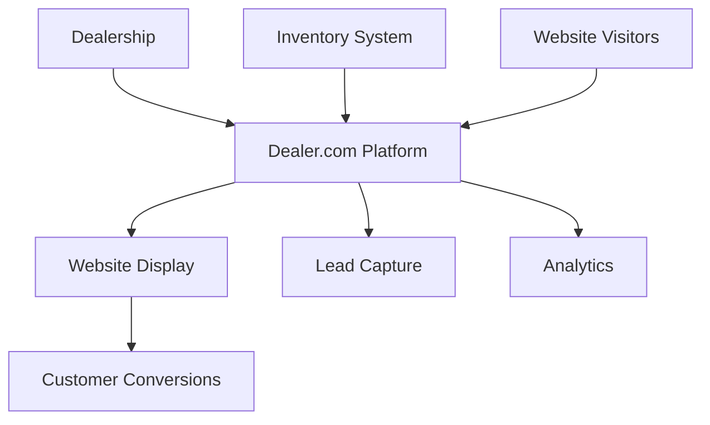

**Category:** Automotive & Dealership Platforms
**Difficulty:** Intermediate
**Reading time:** 6 min read

---

Dealer.com is a Cox Automotive company providing hosted website platforms for automotive dealerships, including inventory management, lead capture, and multi-channel marketing tools integrated into a complete digital solution. It enables dealerships to establish professional online presences without technical expertise.

- **Hosted website builder** — drag-and-drop customization without coding
- **Inventory integration** — automatic vehicle listing updates from DMS systems
- **Lead management** — capture and distribution of customer inquiries
- **Mobile optimization** — responsive design across all devices
- **Analytics and reporting** — traffic and conversion insights

Dealer.com provides dealerships with a complete hosted website platform combining design tools, inventory integration, and marketing capabilities. Dealerships can build custom websites using pre-designed templates without coding knowledge. Inventory automatically syncs from the dealership's DMS or inventory system, displaying vehicle details, photos, and pricing. Visitors can schedule test drives, request information, and submit leads directly through the site. The platform includes email marketing, live chat integration, and social media tools. Built-in analytics track visitor behavior, conversion rates, and lead sources, helping dealerships optimize their digital presence and marketing spend.

- Dealerships seeking complete digital presence solutions without IT overhead
- Multi-location groups needing scalable, consistent website hosting
- Operations wanting integrated lead capture and inventory synchronization
- Dealerships prioritizing mobile customer experience and conversion
- Organizations implementing omnichannel marketing and customer engagement

| Advantage | Disadvantage |
|-----------|--------------|
| Complete integrated platform reduces vendor sprawl | Less customization for unique brand needs |
| Automatic inventory synchronization saves manual effort | Vendor lock-in with Cox Automotive ecosystem |
| Professional templates enable fast time-to-market | Monthly recurring costs accumulate over time |
| Built-in lead management and distribution | Limited control over underlying technology |
| Mobile-first approach aligns with consumer behavior | Migration challenges if switching providers |

- [Cars.com dealer websites](carscom-dealer-websites.md)
- [AutoTrader dealer solutions](autotrader-dealer-solutions.md)
- [Digital retailing platforms](digital-retailing-platforms.md)

---
*Part of the [Automotive & Dealership Platforms](index.md) category · [Back to Master Index](../../index.md)*
