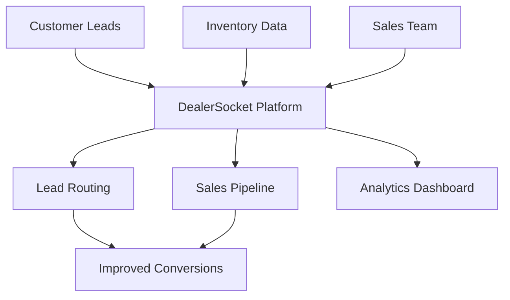

**Category:** Automotive & Dealership Platforms
**Difficulty:** Intermediate
**Reading time:** 6 min read

---

DealerSocket is a cloud-based CRM platform specifically designed for automotive dealerships, offering lead management, sales tracking, and customer relationship features. It integrates with inventory systems and provides analytics for dealership operations.

- **Lead management** — capturing and tracking sales opportunities
- **Sales pipeline** — visualizing customer journey through sales process
- **Integration ecosystem** — connecting with OEM and third-party systems
- **Mobile accessibility** — field sales support through mobile applications
- **Real-time analytics** — performance metrics and KPI tracking

DealerSocket operates as a SaaS platform that aggregates customer leads from various sources and routes them to appropriate sales team members. The system tracks each prospect through the sales funnel, recording interactions, follow-ups, and outcomes. Integration with dealership inventory systems automatically provides vehicle information relevant to customer interests. Mobile apps enable sales staff to access and update customer data in real-time from the showroom floor. The platform's analytics engine provides insights into sales performance, conversion rates, and team productivity. Customizable workflows automate routine tasks like lead assignment and follow-up reminders. The platform stores all customer communication history, enabling better context for future interactions.

- Multi-location dealership chains managing distributed sales teams
- Dealerships improving lead response times and conversions
- Sales organizations implementing structured sales processes
- Dealerships analyzing sales performance and forecasting
- Customer retention through systematic follow-up processes

| Advantage | Disadvantage |
|-----------|--------------|
| Purpose-built for automotive dealerships | Industry-specific nature limits applicability |
| Strong integration with inventory systems | May require customization for unique processes |
| Mobile-first sales support | Training needed for effective adoption |
| Real-time activity tracking | Pricing may be significant for small dealers |
| Proven conversion improvement | Vendor lock-in concerns |

- [Elead CRM for dealerships](elead-crm-for-dealerships.md)
- [VinSolutions CRM hosting](vinsolutions-crm-hosting.md)
- [Lead management for dealers](lead-management-for-dealers.md)

---
*Part of the [Automotive & Dealership Platforms](index.md) category · [Back to Master Index](../../index.md)*
