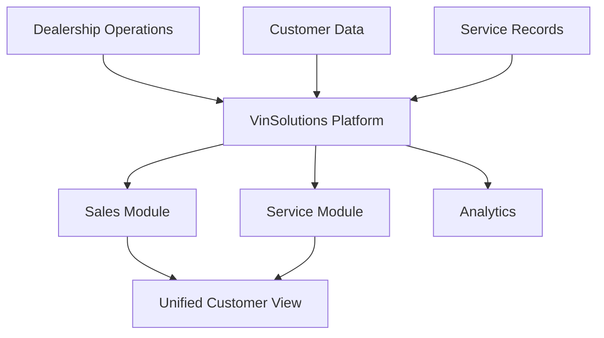

**Category:** Automotive & Dealership Platforms
**Difficulty:** Intermediate
**Reading time:** 6 min read

---

VinSolutions provides cloud-hosted CRM solutions specifically for automotive dealerships, emphasizing customer relationship management, service management, and operational efficiency through integrated platform capabilities.

- **Hosted infrastructure** — cloud-based delivery for reliability and scalability
- **Customer lifecycle** — tracking prospects through purchase and service
- **Multi-channel communication** — email, phone, SMS integration
- **Service integration** — connecting sales and service departments
- **OEM connectivity** — integration with manufacturer systems

VinSolutions operates as a fully hosted platform eliminating on-premise infrastructure concerns. The system integrates sales and service operations, maintaining complete customer history across both departments. Communication channels (email, phone, SMS) are coordinated within the platform, ensuring consistent customer interactions. The service module tracks vehicle maintenance and repairs, while the sales module manages inventory and prospects. Customer data is centralized, enabling cross-selling and improved service recommendations. The platform provides dealership managers with KPIs and performance metrics across departments.

- Multi-department dealerships needing unified customer management
- Dealerships seeking cloud reliability without IT overhead
- Service-focused dealerships improving customer retention
- Organizations optimizing customer communication channels
- Dealerships implementing omnichannel customer engagement

| Advantage | Disadvantage |
|-----------|--------------|
| Fully managed cloud hosting | Subscription-based ongoing costs |
| Unified sales and service view | Industry-specific feature set |
| Multi-channel communication | Migration complexity from legacy systems |
| Strong manufacturer relationships | Less customization than on-premise |
| Reduced IT overhead | Vendor dependence for updates |

- [DealerSocket CRM platform](dealersocket-crm-platform.md)
- [Elead CRM for dealerships](elead-crm-for-dealerships.md)
- [Lead management for dealers](lead-management-for-dealers.md)

---
*Part of the [Automotive & Dealership Platforms](index.md) category · [Back to Master Index](../../index.md)*
