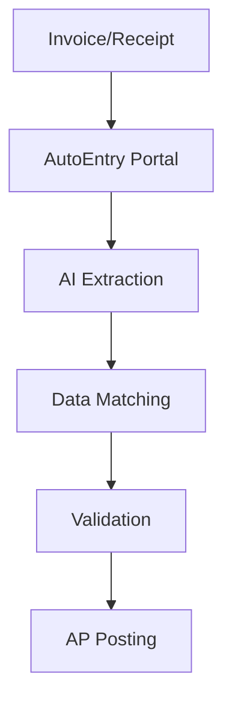

**Category:** Bookkeeping & Financial Management
**Difficulty:** Intermediate
**Reading time:** 6 min read

---

AutoEntry is an intelligent receipt capture and processing platform that automates accounts payable processes using advanced OCR and AI. It extracts invoice and receipt data accurately and posts directly to accounting software, eliminating manual data entry.

- **Intelligent OCR** — advanced optical character recognition
- **Invoice Processing** — automated AP data extraction
- **Receipt Capture** — mobile and email submission
- **Data Validation** — accuracy checking and matching
- **GL Posting** — direct accounting software integration

AutoEntry uses machine learning to capture and process financial documents with high accuracy. Invoices and receipts come in via email, the web portal, or API integrations. The system analyzes document structure and content to identify invoice elements: vendor, amount, date, line items, and tax. It matches extracted data against vendor master records and validates against purchase orders when available. The system learns from corrections to improve accuracy over time. Processing workflows can require approval before posting for control purposes. Once approved, AutoEntry creates journal entries and posts directly to accounting systems like Xero, QuickBooks, Sage, or NetSuite. Processing can match against PO data for three-way matching in purchase-to-pay workflows.

- Automating accounts payable invoice processing
- Reducing manual invoice data entry workload
- Processing high volumes of supplier invoices
- Creating automated three-way match workflows
- Digitizing receipt and invoice records

| Advantage | Disadvantage |
|-----------|--------------|
| High OCR accuracy | Learning curve for setup |
| Seamless AP automation | Per-invoice processing costs |
| PO matching capability | Dependent on document quality |
| Multiple submission methods | Limited to specific accounting systems |
| Continuous learning | Complex workflow customization |

- [Receipt Bank (now Dext)](receipt-bank-now-dext.md)
- [Dext Prepare document extraction](dext-prepare-document-extraction.md)
- [Hubdoc document management](hubdoc-document-management.md)

---
*Part of the [Bookkeeping & Financial Management](bookkeeping-financial-management/index.md) category · [Back to Master Index](../../index.md)*
