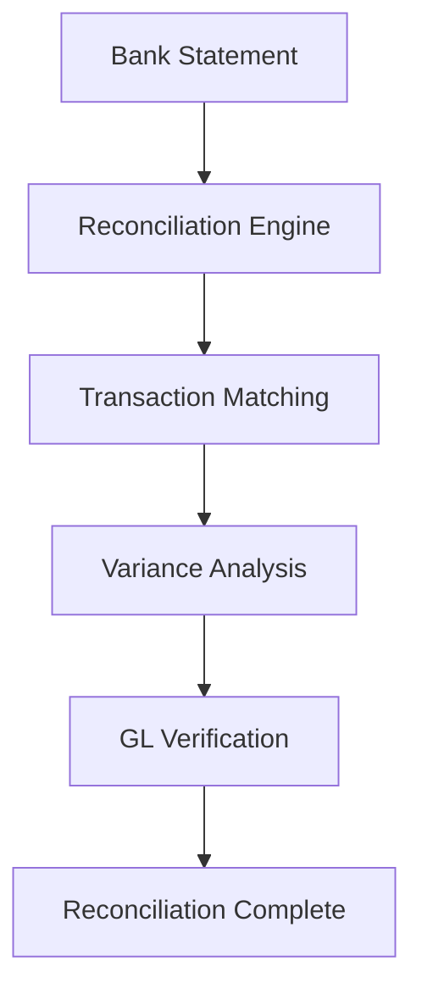

**Category:** Bookkeeping & Financial Management
**Difficulty:** Intermediate
**Reading time:** 6 min read

---

Bank reconciliation automation platforms match transactions between bank statements and accounting software, identifying discrepancies and streamlining the reconciliation process. They reduce the manual effort required for reconciliations from hours to minutes.

- **Transaction Matching** — automatic GL-to-bank matching
- **Variance Detection** — identifying unmatched items
- **Float Management** — tracking in-transit transactions
- **Multi-currency** — handling foreign exchange
- **Audit Trail** — recording all reconciliation activities

Bank reconciliation platforms connect to banks and accounting systems to automate matching. The system downloads bank transactions and GL entries, analyzing them for matches. It matches transactions by amount, date, and reference information. The platform identifies unmatched items as deposits in transit, outstanding checks, or GL errors. It calculates float for transactions not yet cleared. For multi-currency accounts, the system applies exchange rates and identifies currency variance. Once all transactions are matched, the platform verifies that the reconciled GL balance matches the bank balance. If discrepancies exist, it provides analysis to identify the cause. Reconciliation workflows can require approval before posting adjustments. Audit trails document all matching activities and corrections.

- Automating daily or weekly bank reconciliation
- Reducing reconciliation time for multiple accounts
- Identifying fraud and unauthorized transactions
- Managing foreign exchange in multi-currency accounts
- Streamlining month-end close processes

| Advantage | Disadvantage |
|-----------|--------------|
| Dramatically faster reconciliation | Initial bank setup required |
| Reduces manual errors | Recurring timing issues |
| Improves cash visibility | Complex transaction matching |
| Multi-account efficiency | Integration dependencies |
| Audit compliance | Exception handling complexity |

- [Month-end close automation](month-end-close-automation.md)
- [Financial statement preparation platforms](financial-statement-preparation-platforms.md)
- [Dext Commerce e-commerce accounting](dext-commerce-e-commerce-accounting.md)

---
*Part of the [Bookkeeping & Financial Management](bookkeeping-financial-management/index.md) category · [Back to Master Index](../../index.md)*
