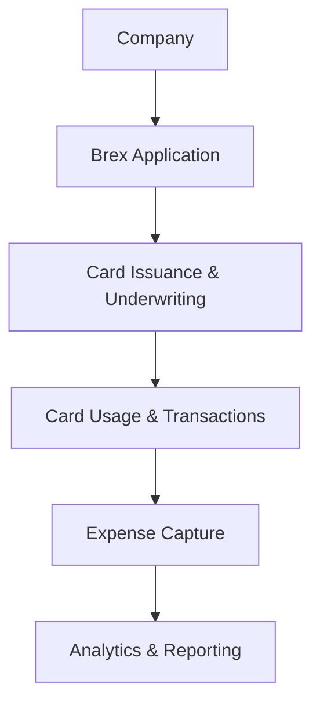

**Category:** Bookkeeping & Financial Management
**Difficulty:** Intermediate
**Reading time:** 6 min read

---

Brex is a financial services platform that provides corporate cards, expense management, and spend intelligence to high-growth companies. The Brex corporate card platform combines advanced underwriting, real-time controls, and comprehensive financial operations tools designed for modern finance teams.

- **Corporate Cards** — physical and virtual payment cards with embedded controls
- **Real-time Controls** — spending limits and policy enforcement
- **Expense Management** — integrated receipt capture and categorization
- **Spend Intelligence** — AI-driven spending analytics and insights
- **Financial Integration** — seamless integration with accounting systems

Brex provides a comprehensive financial operations platform starting with corporate card issuance. The platform uses advanced underwriting to approve companies quickly, often within minutes. Once approved, companies receive physical and virtual cards with customizable spending controls. Employees can create temporary virtual cards for specific purchases with set limits. The platform captures all transactions in real-time and uses AI to automatically categorize expenses and match receipts. Brex's spend intelligence tools analyze spending patterns, identify cost-saving opportunities, and provide benchmarking against industry peers. Integration with accounting software enables automatic journal entry creation and bank reconciliation.

- Providing fast-approval corporate credit for startups
- Controlling employee spending with real-time limits
- Automating expense tracking and receipt capture
- Analyzing spend patterns and cost optimization
- Streamlining accounting operations and reconciliation

| Advantage | Disadvantage |
|-----------|--------------|
| Fast approval and issuance | Credit requirement for approval |
| Strong spend intelligence tools | Premium pricing for features |
| Real-time transaction controls | Account minimums and limits |
| Comprehensive dashboard | Integration complexity |
| Virtual card flexibility | Employee fee structures |

- [Ramp corporate cards](ramp-corporate-cards.md)
- [Divvy expense management](divvy-expense-management.md)
- [Brex expense management](brex-expense-management.md)

---
*Part of the [Bookkeeping & Financial Management](bookkeeping-financial-management/index.md) category · [Back to Master Index](../../index.md)*
