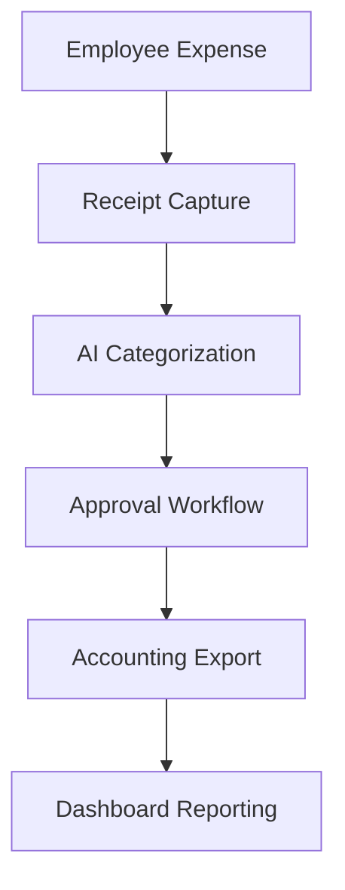

**Category:** Bookkeeping & Financial Management
**Difficulty:** Intermediate
**Reading time:** 6 min read

---

Brex expense management is an integrated solution for capturing, categorizing, and managing employee expenses alongside corporate card transactions. It provides automated receipt capture, approval workflows, and seamless accounting integration designed to reduce the manual workload of finance teams.

- **Receipt Capture** — AI-powered scanning and digitization
- **Expense Categorization** — automatic classification and coding
- **Approval Workflows** — configurable approval routing and policies
- **Integration** — seamless connection to accounting software
- **Reporting** — comprehensive dashboards and analytics

Brex expense management captures expenses through multiple channels: automatic card transactions, manual receipt uploads via mobile app, and email forwarding. The platform uses OCR and AI to extract invoice details including vendor, amount, category, and date. Employees can attach supporting documents and provide additional context. The system routes expenses through configurable approval chains based on amount, category, and policy rules. Approved expenses are automatically coded to the correct GL accounts based on company-defined mappings. All data syncs to accounting systems like QuickBooks Online, NetSuite, or Sage Intacct, creating balanced journal entries. Finance teams gain visibility through dashboards showing spending trends, policy violations, and variance analysis.

- Automating expense report processing and approval
- Capturing receipts without manual data entry
- Enforcing spending policies across the organization
- Creating audit-ready expense records
- Streamlining monthly close processes

| Advantage | Disadvantage |
|-----------|--------------|
| Powerful AI receipt extraction | Learning curve for categorization setup |
| Automated approval workflows | Integration setup required |
| Real-time expense visibility | Per-employee license costs |
| Accounting integration | Policy customization complexity |
| Mobile app convenience | Requires employee participation |

- [Ramp spend management](ramp-spend-management.md)
- [Emburse expense software](emburse-expense-software.md)
- [Month-end close automation](month-end-close-automation.md)

---
*Part of the [Bookkeeping & Financial Management](bookkeeping-financial-management/index.md) category · [Back to Master Index](../../index.md)*
