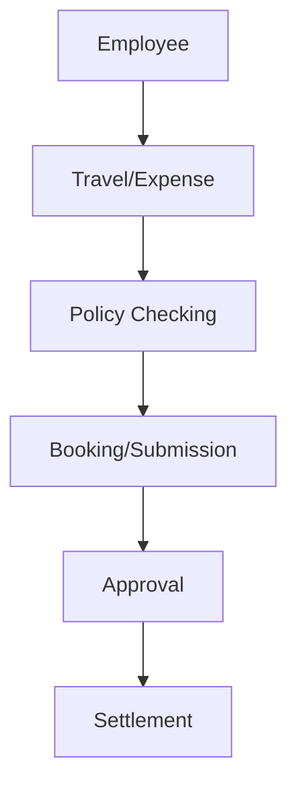

**Category:** Bookkeeping & Financial Management
**Difficulty:** Intermediate
**Reading time:** 6 min read

---

Certify is a comprehensive expense and travel management platform designed for enterprise organizations. It combines expense reporting, travel booking, and policy enforcement with advanced reporting and integration capabilities for managing employee spending at scale.

- **Travel Booking** — integrated travel reservation and management
- **Expense Reports** — automated submission and approval
- **Policy Compliance** — real-time spending policy enforcement
- **Receipt Digitization** — OCR and document management
- **Analytics** — comprehensive spending reports and insights

Certify integrates travel booking and expense management into a single platform. Employees can book flights, hotels, and rental cars within the system with pre-approved vendors and rates. The platform enforces spending policies at the point of booking, preventing non-compliant reservations. For expenses incurred outside the booking system, employees submit receipt-based expense reports. The platform captures receipt images and extracts data via OCR. All transactions flow through configurable approval workflows based on amount and policy rules. Once approved, the system settles expenses through reimbursement to employees or direct payment to vendors. Finance teams gain visibility through dashboards showing travel and expense spending, policy violations, cost center allocations, and individual employee spending patterns. Integration with accounting systems enables automatic GL coding and journal entries.

- Managing travel and expense programs in enterprises
- Enforcing policy compliance across global organizations
- Integrating travel booking with expense management
- Reducing travel spend through preferred vendors
- Streamlining month-end expense accruals and settlements

| Advantage | Disadvantage |
|-----------|--------------|
| Integrated travel and expense | Complex pricing model |
| Strong policy enforcement | Implementation timeline |
| Travel pre-booking capability | Integration complexity |
| Comprehensive reporting | User adoption challenges |
| Enterprise scalability | Support responsiveness |

- [Chrome River expense reports](chrome-river-expense-reports.md)
- [Emburse expense software](emburse-expense-software.md)
- [Zoho Expense tracking](zoho-expense-tracking.md)

---
*Part of the [Bookkeeping & Financial Management](bookkeeping-financial-management/index.md) category · [Back to Master Index](../../index.md)*
