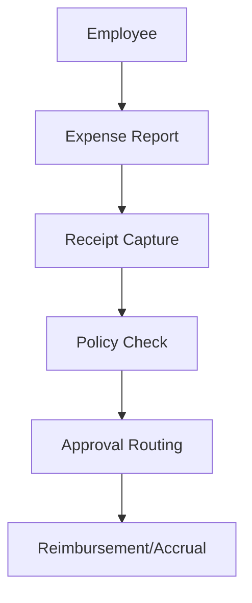

**Category:** Bookkeeping & Financial Management
**Difficulty:** Intermediate
**Reading time:** 6 min read

---

Chrome River is an enterprise-grade expense management platform that automates the entire expense report lifecycle from submission to reimbursement. It provides advanced receipt capture, policy enforcement, and reporting designed for large organizations with complex approval workflows and compliance requirements.

- **Expense Reports** — structured submission and approval workflows
- **Receipt Management** — advanced image capture and storage
- **Policy Enforcement** — real-time compliance checking
- **Approval Routing** — flexible multi-level approval chains
- **Integration** — connections to ERP and accounting systems

Chrome River provides a comprehensive expense reporting platform used by large enterprises. Employees create expense reports within their travel and expense portal, attaching receipts for each item. The platform captures receipt images and uses OCR to extract transaction details. The system validates submissions against corporate policies, including spending limits, approved vendors, category rules, and tax regulations. Reports route through multi-level approval chains configured per department and cost center. Managers review expenses with full context including receipt images and policy explanations. Once approved, the system integrates with accounting and ERP systems to create accruals or generate reimbursement payments. The platform provides robust reporting on spending by department, cost center, and employee, with audit trails for compliance.

- Managing expense reports in large enterprise environments
- Enforcing complex approval workflows across multiple departments
- Capturing and archiving receipts for audit purposes
- Integrating with SAP, Oracle, and other ERP systems
- Generating compliance reports and spending analytics

| Advantage | Disadvantage |
|-----------|--------------|
| Strong approval workflow controls | Complex configuration |
| Enterprise-grade scalability | Higher cost structure |
| Robust integration capabilities | Longer implementation timeline |
| Comprehensive audit trails | Steep learning curve |
| Advanced reporting | Legacy user interface |

- [Certify expense management](certify-expense-management.md)
- [Emburse expense software](emburse-expense-software.md)
- [Month-end close automation](month-end-close-automation.md)

---
*Part of the [Bookkeeping & Financial Management](bookkeeping-financial-management/index.md) category · [Back to Master Index](../../index.md)*
