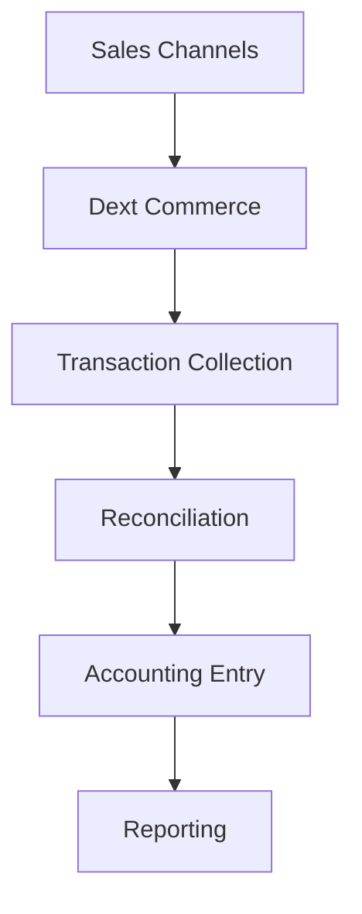

**Category:** Bookkeeping & Financial Management
**Difficulty:** Intermediate
**Reading time:** 6 min read

---

Dext Commerce is a specialized accounting solution for e-commerce businesses that automates the capture and reconciliation of transactions from online marketplaces and payment processors. It provides complete visibility into multi-channel sales and simplifies month-end closing for e-commerce operations.

- **Multi-channel Integration** — connecting all sales channels
- **Transaction Capture** — automatic data collection from marketplaces
- **Reconciliation** — matching transactions to accounting records
- **Tax Compliance** — tracking sales tax and nexus rules
- **Reporting** — channel-specific financial insights

Dext Commerce connects to e-commerce platforms like Shopify, WooCommerce, Amazon, eBay, and payment processors like Stripe and PayPal. The platform automatically collects transaction data from all channels into a single system. It reconciles transactions between sales records, inventory, and payments to identify discrepancies. The system handles multi-currency transactions and converts to the reporting currency. It allocates revenue to the correct accounting periods and applies sales tax rules by jurisdiction. Dext Commerce creates journal entries for revenue, cost of goods sold, sales tax, and payment processing fees. Reporting provides channel-specific performance metrics showing revenue, transactions, and fees by marketplace.

- Automating e-commerce accounting for multi-channel sellers
- Reconciling marketplace, payment, and inventory data
- Managing sales tax across multiple jurisdictions
- Analyzing financial performance by sales channel
- Streamlining month-end close for online retailers

| Advantage | Disadvantage |
|-----------|--------------|
| Multi-channel integration | Limited customization |
| Automatic reconciliation | Learning curve for setup |
| Sales tax management | Per-transaction fees |
| Real-time reporting | Channel integration limits |
| Reduced manual entry | Limited for complex operations |

- [Dext Prepare document extraction](dext-prepare-document-extraction.md)
- [Receipt Bank (now Dext)](receipt-bank-now-dext.md)
- [Bank reconciliation automation](bank-reconciliation-automation.md)

---
*Part of the [Bookkeeping & Financial Management](bookkeeping-financial-management/index.md) category · [Back to Master Index](../../index.md)*
